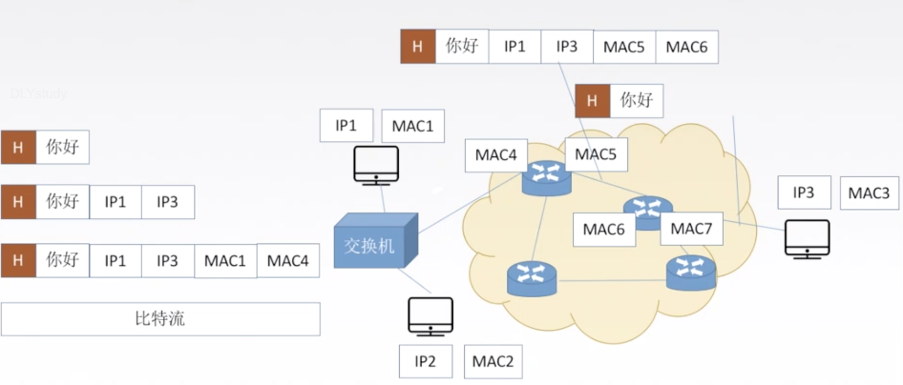

## 计算机网络概述

> 将分散的、具有独立功能的**计算机系统**，通过**通信设备**和**线路**连接起来，由功能完善的**软件**实现**资源共享**和**信息传递**的系统
>
> 计算机网络是**互连、自治**（无主从）的计算机集合。

#### 计算机网络的组成

#### 现实中的例子

- 吃鸡 RTT 往返传播时延
- 路由器 WAN、 LAN（局域网）口
- 手机两个网卡，SIM WLAN

#### tips

- 考点多，分值低
- 抓住**重点**，理解记忆
- 考前记一记细节

#### 重要考点/方面

- 网络体系结构
  - 协议
  - 网络设备
  - 应用于典型网络（以太网）

#### qq通信例子

每一跳都有封装、解封装的过程