# HTTP协议


## 介绍

### HTTP 协议用于客户端和服务器端之间的通信

HTTP 协议和 TCP/IP 协议族内的其他众多的协议相同,用于客户端和服务器之间的通信。

请求访问文本或图像等资源的一端称为客户端,而提供资源响应的一端称为服务器端。

### HTTP 是不保存状态的协议

HTTP 是一种不保存状态,即无状态(stateless)协议。HTTP 协议自身不对请求和响应之间的通信状态进行保存。也就是说在 HTTP 这个级别,协议对于发送过的请求或响应都不做持久化处理。

使用 HTTP 协议,每当有新的请求发送时,就会有对应的新响应产生。

**协议本身并不保留之前一切的请求或响应报文的信息。**

## HTTP报文

用于 HTTP 协议交互的信息被称为 HTTP 报文。

请求端(客户端)的HTTP 报文叫做请求报文,响应端(服务器端)的叫做响应报文。

HTTP 报文本身是由多行(用 CR+LF 作换行符)数据构成的字符串文本。

### HTTP请求报文

一个HTTP请求报文由请求行（request line）、请求头部（header）、空行和请求数据4个部分组成，下图给出了请求报文的一般格式。

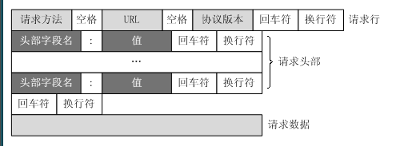

- 请求行

  请求行由请求方法字段、URL字段和HTTP协议版本字段3个字段组成，它们用空格分隔。

  例如，GET /index.html HTTP/1.1。

  HTTP协议的请求方法有GET、POST、HEAD、PUT、DELETE、OPTIONS、TRACE、CONNECT。

- 请求头

- 请求数据

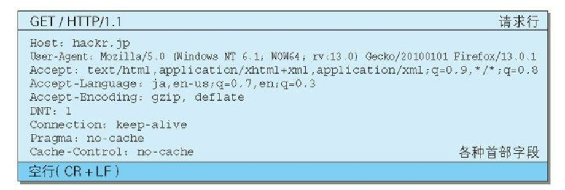


### HTTP响应报文

HTTP响应也由三个部分组成，分别是：状态行、响应头部、响应正文。

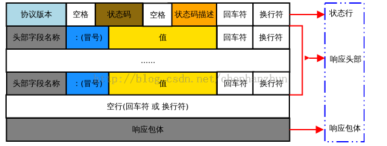

- 状态行
- 响应头部
- 响应正文

#### 实例

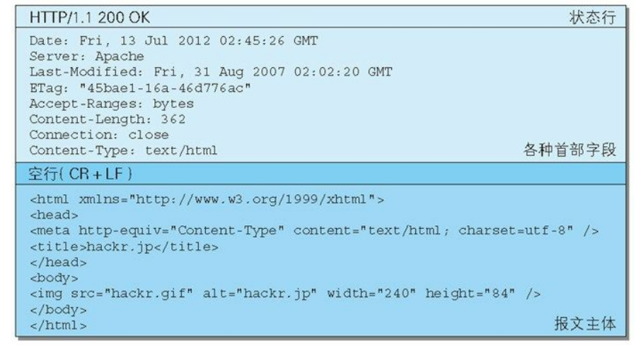


### 首部字段

- 通用首部字段(General Header Fields)
  请求报文和响应报文两方都会使用的首部。
- 请求首部字段(Request Header Fields)
从客户端向服务器端发送请求报文时使用的首部。补充了请求的附加
内容、客户端信息、响应内容相关优先级等信息。
- 响应首部字段(Response Header Fields)
从服务器端向客户端返回响应报文时使用的首部。补充了响应的附加
内容,也会要求客户端附加额外的内容信息。
- 实体首部字段(Entity Header Fields)
针对请求报文和响应报文的实体部分使用的首部。补充了资源内容更
新时间等与实体有关的信息。


#### 通用首部


  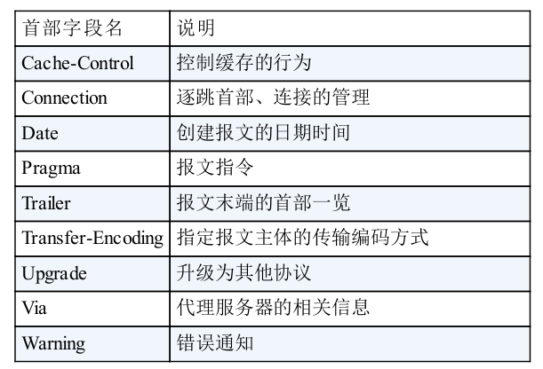


- Connection: keep-alive

  

#### 请求首部

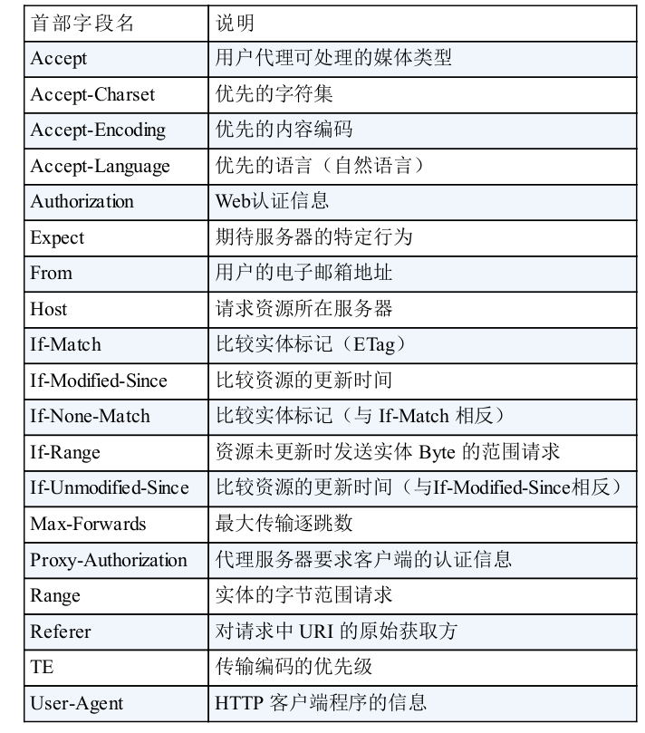


#### 响应首部

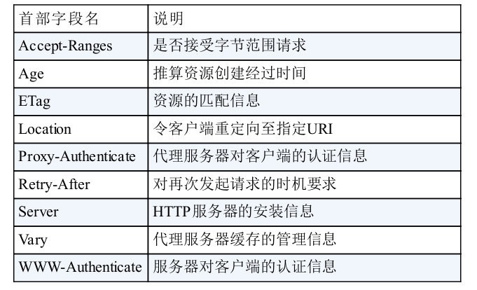

#### 实体首部

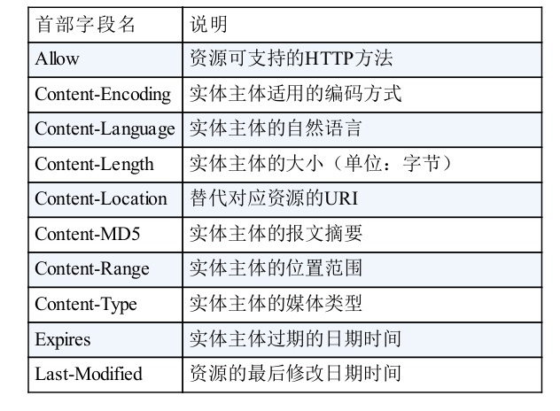


## 状态码

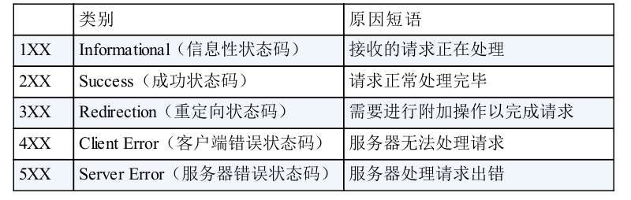

### 2XX 成功

#### 200 OK

### 3XX 重定向

#### 301 Moved Permanently

永久性重定向。该状态码表示请求的资源已被分配了新的 URI,以后应使用资源现在所指的 URI。也就是说,如果已经把资源对应的 URI保存为书签了,这时应该按 Location 首部字段提示的 URI 重新保存。

#### 302 Moved Temporarily 

临时性重定向。该状态码表示请求的资源已被分配了新的 URI,希望
用户(本次)能使用新的 URI 访问。
和 301 Moved Permanently 状态码相似,但 302 状态码代表的资源不
是被永久移动,只是临时性质的。

#### 303 See Other

303 状态码和 302 Found 状态码有着相同的功能,但 303 状态码明确表示客户端应当采用 GET 方法获取资源,这点与 302 状态码有区别。

> 当 301、302、303 响应状态码返回时,几乎所有的浏览器都会把POST 改成 GET,并删除请求报文内的主体,之后请求会自动再次发送。
> 301、302 标准是禁止将 POST 方法改变成 GET 方法的,但实际使用时大家都会这么做。

#### 304 Not Modified

如果客户端发送了一个带条件的GET 请求且该请求已被允许，而文档的内容（自上次访问以来或者根据请求的条件）并没有改变，则服务器应当返回这个304状态码。简单的表达就是：服务端已经执行了GET，但文件未变化。

### 4XX 客户端错误

#### 400 Bad Request

该状态码表示请求报文中存在语法错误。当错误发生时,需修改请求的内容后再次发送请求。另外,浏览器会像 200 OK 一样对待该状态码。

#### 401 Unauthorized

该状态码表示发送的请求需要有通过 HTTP 认证(BASIC 认证、DIGEST 认证)的认证信息。另外若之前已进行过 1 次请求,则表示用户认证失败。

返回含有 401 的响应必须包含一个适用于被请求资源的 WWW-Authenticate 首部用以质询(challenge)用户信息。当浏览器初次接收到 401 响应,会弹出认证用的对话窗口。

#### 403 Forbidden

该状态码表明对请求资源的访问被服务器拒绝了。服务器端没有必要给出拒绝的详细理由.

未获得文件系统的访问授权,访问权限出现某些问题(从未授权的发送源 IP 地址试图访问)等列举的情况都可能是发生 403 的原因。

#### 404 Not Found

### 5XX 服务器错误

#### 500 Internal Server Error

该状态码表明服务器端在执行请求时发生了错误。也有可能是 Web应用存在的 bug 或某些临时的故障。一般是bug，比如数据库挂了。

#### 502 Bad Gateway

 后端服务挂掉或者压力过大的时候， Nginx接到的请求无法及时传递给后端的服务进行处理，这个时候就会出现502错误。这个也非常常见，知乎豆瓣网站经常开小差的时候发生的错误就是这个。

#### 503 Service Unavailable

该状态码表明服务器暂时处于超负载或正在进行停机维护,现在无法处理请求。


## 长连接 短连接

### 介绍

HTTP的长连接和短连接本质上是TCP长连接和短连接

**在`HTTP/1.0`中，默认使用的是短连接**。也就是说，浏览器和服务器每进行一次HTTP操作，就建立一次连接，但任务结束就中断连接。如果客户端浏览器访问的某个HTML或其他类型的 Web页中包含有其他的Web资源，如JavaScript文件、图像文件、CSS文件等；当浏览器每遇到这样一个Web资源，就会建立一个HTTP会话。

但从 **HTTP/1.1起，默认使用长连接**，用以保持连接特性。使用长连接的HTTP协议，会在响应头有加入这行代码：

```
Connection:keep-alive
```

在使用长连接的情况下，当一个网页打开完成后，客户端和服务器之间用于传输HTTP数据的 TCP连接不会关闭，如果客户端再次访问这个服务器上的网页，会继续使用这一条已经建立的连接。Keep-Alive不会永久保持连接，它有一个保持时间，可以在不同的服务器软件（如Apache）中设定这个时间。实现长连接要客户端和服务端都支持长连接。


### TCP短连接

我们模拟一下TCP短连接的情况，client向server发起连接请求，server接到请求，然后双方建立连接。

client向server 发送消息，server回应client，然后一次读写就完成了，这时候双方任何一个都可以发起close操作，不过一般都是client先发起 close操作。为什么呢，一般的server不会回复完client后立即关闭连接的，当然不排除有特殊的情况。从上面的描述看，短连接一般只会在 client/server间传递一次读写操作

短连接的优点是：管理起来比较简单，存在的连接都是有用的连接，不需要额外的控制手段

### TCP长连接

client向server发起连接，server接受client连接，双方建立连接。Client与server完成一次读写之后，它们之间的连接并不会主动关闭，后续的读写操作会继续使用这个连接。

首先说一下TCP/IP详解上讲到的TCP保活功能，保活功能主要为服务器应用提供，服务器应用希望知道客户主机是否崩溃，从而可以代表客户使用资源。如果客户已经消失，使得服务器上保留一个半开放的连接，而服务器又在等待来自客户端的数据，则服务器将应远等待客户端的数据，保活功能就是试图在服务器端检测到这种半开放的连接。

如果一个给定的连接在两小时内没有任何的动作，则服务器就向客户发一个探测报文段，客户主机必须处于以下4个状态之一：

1. 客户主机依然正常运行，并从服务器可达。客户的TCP响应正常，而服务器也知道对方是正常的，服务器在两小时后将保活定时器复位。
2. 客户主机已经崩溃，并且关闭或者正在重新启动。**在任何一种情况下，客户的TCP都没有响应。服务端将不能收到对探测的响应，并在75秒后超时。服务器总共发送10个这样的探测 ，每个间隔75秒。如果服务器没有收到一个响应，它就认为客户主机已经关闭并终止连接。**
3. 客户主机崩溃并已经重新启动。服务器将收到一个对其保活探测的响应，这个响应是一个复位，使得服务器终止这个连接。
4. 客户机正常运行，但是服务器不可达，这种情况与2类似，TCP能发现的就是没有收到探查的响应。

### 长短连接操作过程

```
短连接的操作步骤是：
建立连接——数据传输——关闭连接...建立连接——数据传输——关闭连接
长连接的操作步骤是：
建立连接——数据传输...（保持连接）...数据传输——关闭连接
```

### **长连接和短连接的优点和缺点**

　由上可以看出，**长连接**可以**省去较多的TCP建立和关闭的操作，减少浪费，节约时间**。对于频繁请求资源的客户来说，较适用长连接。不过这里**存在一个问题**，**存活功能的探测周期太长**，还有就是它只是探测TCP连接的存活，属于比较斯文的做法，遇到恶意的连接时，保活功能就不够使了。在长连接的应用场景下，client端一般不会主动关闭它们之间的连接，**Client与server之间的连接如果一直不关闭的话，会存在一个问题，随着客户端连接越来越多，server早晚有扛不住的时候**，这时候server端需要采取一些策略，如关闭一些长时间没有读写事件发生的连接，这样可 以避免一些恶意连接导致server端服务受损；如果条件再允许就可以以客户端机器为颗粒度，限制每个客户端的最大长连接数，这样可以完全避免某个蛋疼的客户端连累后端服务。

**短连接**对于服务器来说管理较为简单，存在的连接都是有用的连接，不需要额外的控制手段。但如果客户**请求频繁**，将在**TCP的建立和关闭操作上浪费时间和带宽**。

长连接和短连接的产生在于client和server采取的关闭策略，具体的应用场景采用具体的策略，没有十全十美的选择，只有合适的选择。


### **什么时候用长连接，短连接？** 

**长连接**多用于操作频繁，点对点的通讯，而且连接数不能太多情况。每个TCP连接都需要三步握手，这需要时间，如果每个操作都是先连接，再操作的话那么处理速度会降低很多，所以每个操作完后都不断开，再次处理时直接发送数据包就OK了，不用重新建立TCP连接。

例如：数据库的连接用长连接， 如果用短连接频繁的通信会造成socket错误，而且频繁的socket 创建也是对资源的浪费。 

而像WEB网站的http服务一般都用**短链接**，因为长连接对于服务端来说会耗费一定的资源，而像WEB网站这么频繁的成千上万甚至上亿客户端的连接用短连接会更省一些资源，如果用长连接，而且同时有成千上万的用户，如果每个用户都占用一个连接的话，那可想而知吧。所以并发量大，但每个用户无需频繁操作情况下需用短连接好。


## 长短轮询

所谓轮询，即是在一个循环周期内不断发起请求来得到数据的机制。只要有请求的的地方，都可以实现轮询，譬如各种事件驱动模型。**它的长短是在于某次请求的返回周期**。

- **短轮询**
  短轮询指的是在循环周期内，不断发起请求，每一次请求都立即返回结果，根据新旧数据对比决定是否使用这个结果。

- **长轮询**
  而长轮询及是在请求的过程中，若是服务器端数据并没有更新，那么则将这个连接hold住，直到有新消息服务器才返回响应信息，然后再进入循环周期。

由上可以看到，长短轮询的理想实现都应当基于长连接,否则若是循环周期太短，那么服务器的荷载会相当重；当然，即便是在长连接下，访问人数过多，长短轮询都有可能造成服务器的瞬时访问量庞大，这就需要一些相应的优化实践了。


  

## Cookies

HTTP 是无状态协议,它不对之前发生过的请求和响应的状态进行管理。也就是说,无法根据之前的状态进行本次的请求处理。

保留无状态协议这个特征的同时又要解决类似的矛盾问题,于是引入了 Cookie 技术。Cookie 技术通过在请求和响应报文中写入 Cookie 信息来控制客户端的状态。

Cookie 会根据从服务器端发送的响应报文内的一个叫做 Set-Cookie 的首部字段信息,通知客户端保存 Cookie。当下次客户端再往该服务器发送请求时,客户端会自动在请求报文中加入 Cookie 值后发送出
去。

服务器端发现客户端发送过来的 Cookie 后,会去检查究竟是从哪一个客户端发来的连接请求,然后对比服务器上的记录,最后得到之前的状态信息。

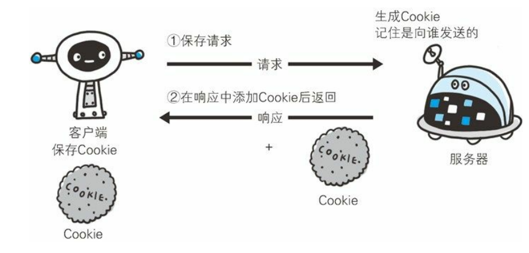

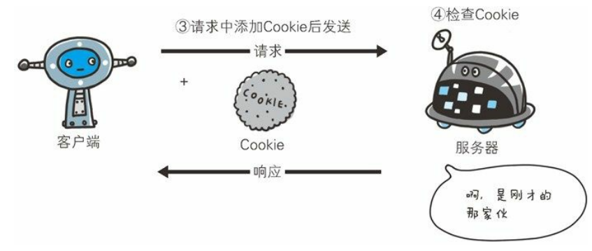


## HTTPS（HTTP+ 加密 + 认证 + 完整性保护）

在 HTTP 协议中有可能存在信息窃听或身份伪装等安全问题。使用HTTPS 通信机制可以有效地防止这些问题。本章我们就了解一下HTTPS。

HTTPS通过和 SSL(Secure Socket Layer,安全套接层)或TLS(Transport Layer Security,安全层传输协议)的组合使用,加密 HTTP 的通信内容。

### HTTP的不足

- 通信使用明文(不加密),内容可能会被窃听
- 不验证通信方的身份,因此有可能遭遇伪装
-  无法证明报文的完整性,所以有可能已遭篡改

### SSL、TSL

#### 概览

其实`TLS`就是从`SSL`发展而来的，只是`SSL`发展到3.0版本后改成了`TLS`。

`TLS`主要提供三个基本服务

- 加密

- 身份验证，也可以叫证书验证

- 消息完整性校验


#### 握手过程(RSA)

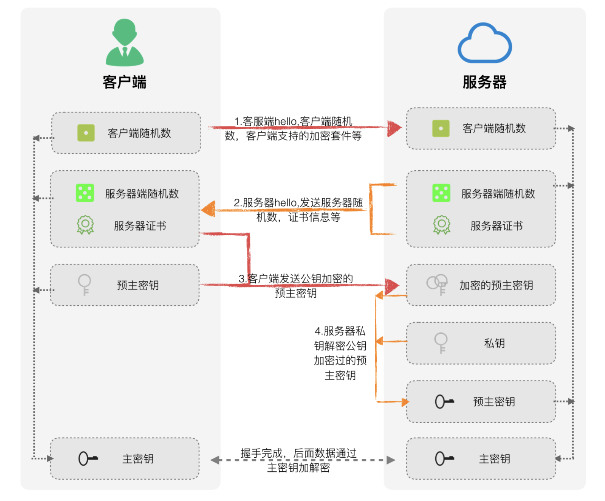

整个流程可以分解为:

1. 客户端向服务器发送Client Hello,告诉服务器，我支持的协议版本，加密套件等信息。
2. 服务器收到响应，选择双方都支持的协议，套件，向客户端发送Server Hello。同时服务器也将自己的证书发送到客户端(Certificate)。
3. 客户端自己生产预主密钥，通过公钥加密预主秘钥，将加密后的预主秘钥发送给服务器 (Client Exchange)。
4. 服务器用自己的私钥解密加密的预主密钥。

之后，客户端与服务器用相同的算法根据客户端随机数，服务器随机数，预主秘钥生产主密钥，之后的通信将都用主密钥加密解密。

更详细的过程参考:

https://www.ruanyifeng.com/blog/2014/02/ssl_tls.html

https://razeencheng.com/post/ssl-handshake-detail.html


#### 证书机制/证书验证

在`TLS`中，我们需要证书来保证你所访问的服务器是真实的，可信的。

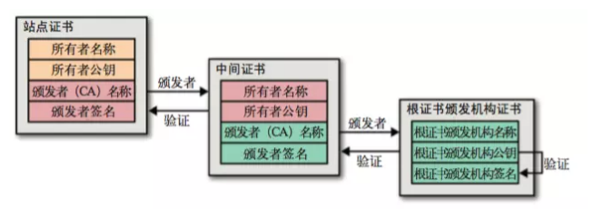

1.客户端获取到了站点证书，拿到了站点的公钥；

2.要验证站点可信后，才能使用其公钥，因此客户端找到其站点证书颁发者的信息；

3.站点证书的颁发者验证了服务端站点是可信的，但客户端依然不清楚该颁发者是否可信；

4.再往上回溯，找到了认证了中间证书商的源头证书颁发者。由于源头的证书颁发者非常少，我们浏览器之前就认识了，因此可以认为根证书颁发者是可信的；

5.一路倒推，证书颁发者可信，那么它所颁发的所有站点也是可信的，最终确定了我们所访问的服务端是可信的；

6.客户端使用证书中的公钥，继续完成`TLS`的握手过程。


### HTTPS于HTTP差异

- HTTP的URL由`http://`起始且默认使用端口80，而HTTPS的URL由`https://`起始且默认使用端口443

- HTTP协议运行在TCP之上，所有传输的内容都是明文，客户端和服务器端都无法验证对方的身份。

  HTTPS是运行在SSL/TLS之上的HTTP协议，SSL/TLS运行在TCP之上。所有传输的内容都经过加密，加密采用对称加密，但对称加密的密钥用服务器方的证书进行了非对称加密。

  1）对称加密：密钥只有一个，加密解密为同一个密码，且加解密速度快，典型的对称加密算法有DES、AES等；
  2）非对称加密：密钥成对出现（且根据公钥无法推知私钥，根据私钥也无法推知公钥），加密解密使用不同密钥（公钥加密需要私钥解密，私钥加密需要公钥解密），相对对称加密速度较慢，典型的非对称加密算法有RSA、DSA等。

  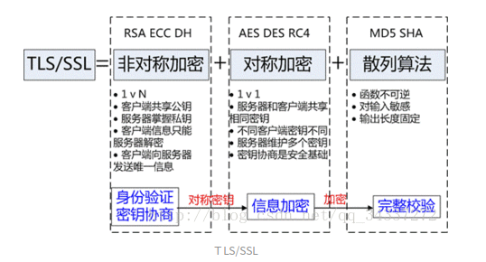

  

## HTTP2.0

### SDPY

SPDY 是 Google 开发的一个实验性协议，于 2009 年年中发布，其主要目标是通过解决 HTTP/1.1 中广为人知的一些性能限制来减少网页的加载延迟。具体来说，这个项目设定的目标如下：

- 页面加载时间 (PLT) 减少 50%。
- 无需网站作者修改任何内容。
- 将部署复杂性降至最低，无需变更网络基础设施。
- 与开源社区合作开发此新协议。
- 收集真实性能数据，验证实验性协议是否有效。

到了 2012 年，这个新的实验性协议得到 Chrome、Firefox 和 Opera 的支持，而且越来越多的大型网站（如 Google、Twitter、Facebook）和小型网站开始在其基础设施内部署 SPDY。 事实上，在被行业越来越多的采用之后，SPDY 已经具备了成为一个标准的条件。

观察到这一趋势后，HTTP 工作组 (HTTP-WG) 将这一工作提上议事日程，吸取 SPDY 的经验教训，并在此基础上制定了官方“HTTP/2”标准。 在拟定宣言草案、向社会征集 HTTP/2 建议并经过内部讨论之后，HTTP-WG 决定将 SPDY 规范作为新 HTTP/2 协议的基础。

在接下来几年中，SPDY 和 HTTP/2 继续共同演化，其中 SPDY 作为实验性分支，用于为 HTTP/2 标准测试新功能和建议。 理论不一定适合实践（反之亦然），SPDY 提供一个测试和评估路线，可以对要纳入 HTTP/2 标准中的每条建议进行测试和评估。


### HTTP2新特性

| 特性                                            |      |      |
| ----------------------------------------------- | ---- | ---- |
| 压缩                                            |      |      |
| 多路复用                                        |      |      |
| TLS 义务化                                      |      |      |
| 客户端拉曳(Client Pull)/服务器推送(Server Push) |      |      |
| 流量控制                                        |      |      |
| WebSocket（与HTTP2解决的问题有重复）            |      |      |


**二进制分帧层**

HTTP/2 所有性能增强的核心在于新的二进制分帧层，它定义了如何封装 HTTP 消息并在客户端与服务器之间传输。

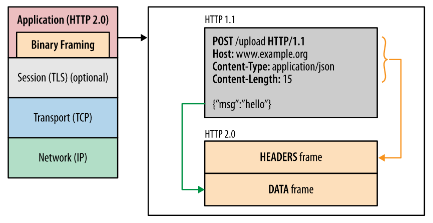


这里所谓的“层”，指的是位于套接字接口与应用可见的高级 HTTP API 之间一个经过优化的新编码机制：HTTP 的语义（包括各种动词、方法、标头）都不受影响，不同的是传输期间对它们的编码方式变了。 HTTP/1.x 协议以换行符作为纯文本的分隔符，而 HTTP/2 将所有传输的信息分割为更小的消息和帧，并采用二进制格式对它们编码。

这样一来，客户端和服务器为了相互理解，都必须使用新的二进制编码机制：HTTP/1.x 客户端无法理解只支持 HTTP/2 的服务器，反之亦然。 不过不要紧，现有的应用不必担心这些变化，因为客户端和服务器会替我们完成必要的分帧工作。

### 参考

https://developers.google.com/web/fundamentals/performance/http2/?hl=zh-cn


## WebSocket

### 双向通信的难题

HTTP 协议有一个特点：被动性。
　　何为被动性呢，其实就是，服务端不能主动联系客户端，只能由客户端发起。
　　举例来说，我们想获得某个数据，就得是客户端（如浏览器）向服务器发出请求，服务器返回查询结果。HTTP 协议做不到服务器主动向客户端推送信息，比如收到新邮件的提示。这种单向请求的特点，注定了如果服务器有连续的状态变化，客户端要获知就非常麻烦。
　　在WebSocket协议之前，实现双向通信的方式主要有轮询（polling）、长轮询（long-polling）轮询需要更快的速度，长轮询需要更多的“手机”，它们都会导致“手机”的需求越来越高。
　　于是，我们再次总结下 HTTP 的两个短板：

- 被动性
  　　服务端不能主动联系客户端，只能由客户端发起。
- 无状态协议
  　　对于事务处理没有记忆能力。通俗的说就是，服务器因为每天要接待太多客户了，是个健忘鬼，你一挂电话，她就把你的东西全忘光了，把你的东西全丢掉了。你第二次还得再告诉服务器一遍。

### websocket介绍

被动性的问题，当服务器完成协议升级后（HTTP→WebSocket），服务端就可以主动推送信息给客户端。

交互流程有区别

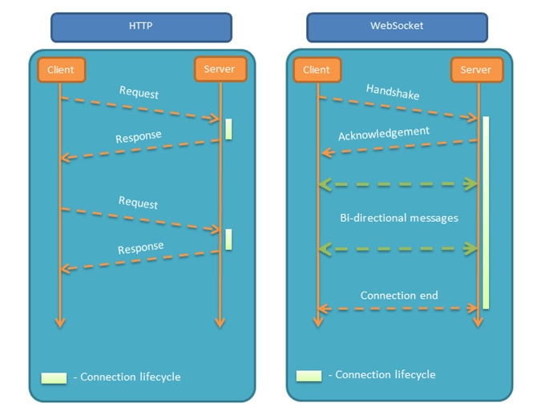


### 特点

（1）建立在 TCP 协议之上，服务器端的实现比较容易。

（2）与 HTTP 协议有着良好的兼容性。默认端口也是80和443，并且握手阶段采用 HTTP 协议，因此握手时不容易屏蔽，能通过各种 HTTP 代理服务器。

（3）数据格式比较轻量，性能开销小，通信高效。

（4）可以发送文本，也可以发送二进制数据。

（5）没有同源限制，客户端可以与任意服务器通信。

（6）协议标识符是`ws`（如果加密，则为`wss`），服务器网址就是 URL。


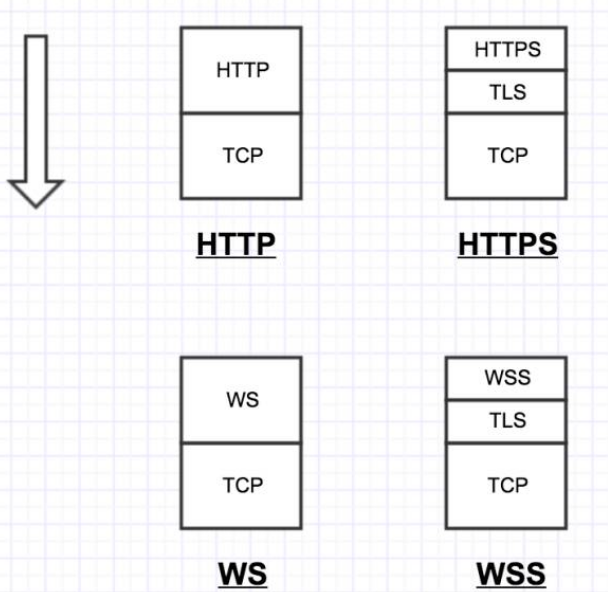


### websock连接建立过程


### 参考

http://www.ruanyifeng.com/blog/2017/05/websocket.html


## 消息推送的方式

###  轮询（polling）

轮询的原理非常简单，让浏览器隔个几秒就发送一次请求，询问服务器是否有新信息。
　　用大白话举例就是：
　　while True:
　　　　客户端：妹子，请你吃饭有空吗？（Request）
　　　　服务端：没有！（Response）
　　　　客户端：妹子，请你吃饭有空吗？（Request）
　　　　服务端：没有。。（Response）
　　　　客户端：妹子，请你吃饭有空吗？（Request）
　　　　服务端：你好烦啊，没有啊。。（Response）
　　　　客户端：妹子，请你吃饭有空吗？（Request）
　　　　服务端：好啦好啦，有啦。（Response）
　　　　客户端：妹子，请你吃饭有空吗？（Request）
　　　　服务端：。。。。。没。。。。没。。。没有（Response）


可以看到，使用轮询的方式，客户端和服务器之间会一直进行连接，每隔一段时间就询问一次。其缺点也很明显：连接数会很多，一个接受，一个发送。而且每次发送请求都会有Http的Header，会很耗流量，也会消耗CPU的利用率。

- 优点：实现简单，无需做过多的更改
- 缺点：轮询的间隔过长，会导致用户不能及时接收到更新的数据；轮询的间隔过短，会导致查询请求过多，增加服务器端的负担


### 长轮询（long-polling）

　长轮询其实原理跟轮询差不多，都是采用轮询的方式，不过采取的是阻塞模型（一直打电话，没收到就不挂电话），也就是说，客户端发起连接后，如果没消息，就一直不返回Response给客户端。直到有消息才返回，返回完之后，客户端再次建立连接，周而复始。
　　还是用大白话举例：
　　while True:
　　　　客户端：妹子，请你吃饭有空吗？没有的话就等有了再返回给我吧！（Request）
　　　　服务端：（额。。现在好忙，先不回复他，电话先不挂。）
　　　　服务端：现在有空了。（Response）
　　　　客户端：妹子，请你吃饭有空吗？没有的话就等有了再返回给我吧！（Request）
　　　　服务端：（额。。现在好忙，先不回复他，电话先不挂。）
　　　　服务端：现在有空了。（Response）

本质上，长轮询是对轮询的改进版，客户端发送HTTP给服务器之后，看有没有新消息，如果没有新消息，就一直等待。当有新消息的时候，才会返回给客户端。在某种程度上减小了网络带宽和CPU利用率等问题。由于http数据包的头部数据量往往很大（通常有400多个字节），但是真正被服务器需要的数据却很少（有时只有10个字节左右），这样的数据包在网络上周期性的传输，难免对网络带宽是一种浪费。

- 优点：比 polling 做了优化，有较好的时效性
- 缺点：保持连接会消耗资源；服务器没有返回有效数据，程序超时。


### WebSocket

一种新的协议，兼容浏览器

### 对比

|          方式          |     类型      |                           技术实现                           |                            优点                            |                             缺点                             |           试用场景           |
| :--------------------: | :-----------: | :----------------------------------------------------------: | :--------------------------------------------------------: | :----------------------------------------------------------: | :--------------------------: |
|    轮询（polling）     | client→server |                        客户端循环请求                        |                   1.实现简单 2.支持跨域                    | 1.浪费带宽和服务器资源 2.一次请求信息大半是无用（完整http头信息） 3.有延迟 4.大部分无效请求 |         适于小型应用         |
| 长轮询（long-polling） | client→server | 服务器hold住连接，一直到有数据或者超时才返回，减少重复请求次数 |      1.实现简单 2.不会频繁发请求 3.节省流量 4.延迟低       |   1.服务器hold住连接，会消耗资源 2.一次请求信息大半是无用    | WebQQ、Hi网页版、Facebook IM |
|       WebSocket        | client⇌server |                       new WebSocket()                        | 1.支持双向通信，实时性更强 2.可发送二进制文件 3.减少通信量 |           1.浏览器支持程度不一致 2.不支持断开重连            |   网络游戏、银行交互和支付   |


### 参考

https://juejin.im/post/5af557a3f265da0b9265a498