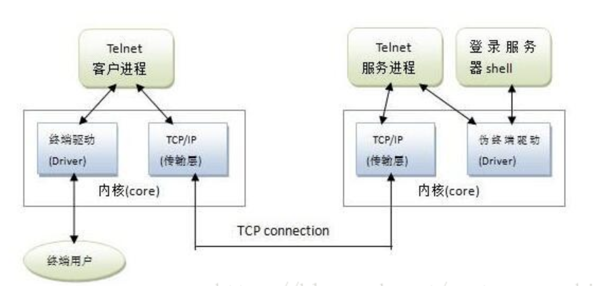
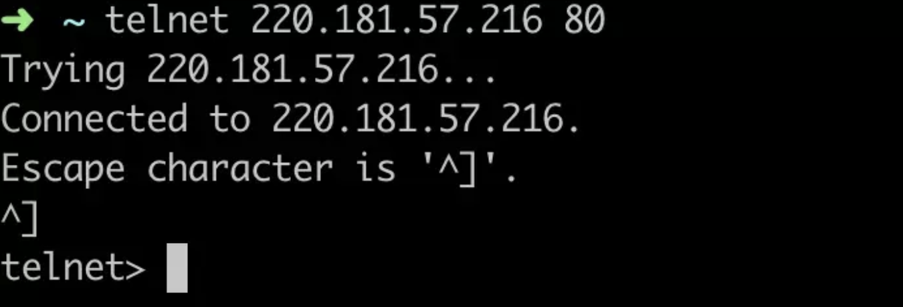

# Telnet终端仿真协议

## 介绍



Telnet协议是TCP/IP协议族中的一员,是teletype network的缩写,属于应用层协议,是Internet远程登录服务的标准协议和主要方式.

Telnet协议是一个明文传送协议，它将用户的所有内容，包括用户名和密码都明文在互联网上传送，具有一定的安全隐患，如果我们要使用远程登录，使用前应在远端服务器上检查并设置允许Telnet服务的功能.

现在基本没有使用telnet server的了

> 提供加密功能的ssh协议现在用的更广泛.

## 过程

1. 本地与远程主机建立连接。该过程实际上是建立一个TCP连接，用户必须知道远程主机的Ip地址或域名；
2. 将本地终端上输入的用户名和口令及以后输入的任何命令或字符以 NVT（Net Virtual Terminal）格式传送到远程主机。该过程实际上是从本地主机向远程主机发送一个IP数据报；
3. 将远程 主机输出的 NVT格式的数据转化为本地所接受的格式送回本地终端，包括输入命令回显和命令执行结果；
4. 使用完之后,本地终端对远程主机进行撤消连接。该过程是撤销一个TCP连接。


## 使用

现在 telnet server几乎没有人在用了，但是 telnet client 却被广泛的使用着。它的功能已经比较强大，有较多巧妙的用法。

### 检查端口打开

> telnet [domainname or ip] [port] 

如果这个网络连接可达，则会提示你Connected to 220.181.57.216，输入control ]可以给这个端口发送数据包了
```shell
telnet 220.181.57.216 80
```



如果网路不可达，则会提示`telnet: Unable to connect to remote host`和具体不能连上的原因，常见的有 Operation timed out、Connection refused。

### 发http请求

我们知道 curl 可以方便的发送 http 请求，telnet 也是可以方便的发送 http 请求的

执行 `telnet www.baidu.com 80`，粘贴下面的文本（注意总共有四行，最后两行为两个空行）

```
GET / HTTP/1.1
Host: www.baidu.com


```

可以看到返回了百度的首页

```
➜ telnet www.baidu.com 80
Trying 14.215.177.38...
Connected to www.a.shifen.com.
Escape character is '^]'.
GET / HTTP/1.1
Host: www.baidu.com

HTTP/1.1 200 OK
Accept-Ranges: bytes
Cache-Control: no-cache
Connection: Keep-Alive
Content-Length: 14615
...
```

### telnet 还可以连接 Redis

假设 redis 服务器跑在本地，监听 6379端口，用 `telnet localhost 6379` 命令可以连接上。接下来就可以调用 redis 的命令。

调用"set hello world"，给 key 为 hello 设置值为 "world"，随后调用 get hello 获取值