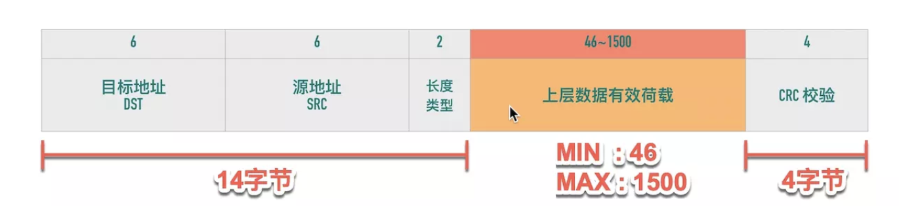
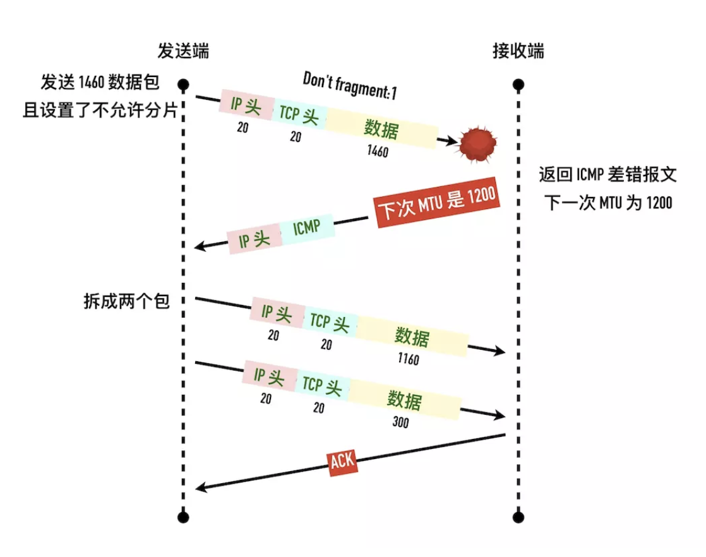

### 链路层--最大传输单元（Maximum Transmission Unit, MTU）

数据链路层传输的帧大小是有限制的，不能把一个太大的包直接塞给链路层，这个限制被称为「最大传输单元（Maximum Transmission Unit, MTU）


以太网的帧最小的帧是 64 字节，除去 14 字节头部和 4 字节 CRC 字段，有效荷载最小为 46 字节。最大的帧是 1518 字节，除去 14 字节头部和 4 字节 CRC，有效荷载最大为 1500，这个值就是以太网的 MTU。因此如果传输 100KB 的数据，至少需要 （100 * 1024 / 1500) = 69 个以太网帧。



不同的数据链路层的 MTU 是不同的。通过`netstat -i` 可以查看网卡的 mtu.

```
Name  Mtu   Network       Address            Ipkts Ierrs    Opkts Oerrs  Coll
en5   1500  <Link#8>    ac:de:48:00:11:22    80338     0    78473   192     0
en5   1500  fe80::aede: fe80:8::aede:48ff    80338     -    78473     -     -
ap1*  1500  <Link#9>    f2:18:98:ae:9e:b2        0     0        0     0     0
en0   1500  <Link#10>   f0:18:98:ae:9e:b2  8409945     0 18070175 175352     0
```


**超过了MTU在网络层会把IP数据包分片.**


### 网络中的木桶效应：路径 MTU

一个包从发送端传输到接收端，中间要跨越很多个网络，每条链路的 MTU 都可能不一样，这个通信过程中最小的 MTU 称为「路径 MTU（Path MTU）」。就好比开车有时候开的是双向 4 车道，有时候可能是乡间小路一样。


在超过了MTU,发送方会收到ICMP的差错报文.




### TCP 最大段大小（Max Segment Size，MSS）

因为有 MTU 的存在，TCP 每次发包的大小也限制了，这就是 MSS。

TCP 为了避免被发送方分片，会主动把数据分割成小段再交给网络层，最大的分段大小称之为 MSS（Max Segment Size）。

```
MSS = MTU - IP header头大小 - TCP 头大小
```

这样一个 MSS 的数据恰好能装进一个 MTU 而不用分片。

在以太网中 TCP 的 MSS = 1500（MTU） - 20（IP 头大小） - 20（TCP 头大小）= 1460

**为什么有时候抓包看到的单个数据包大于 MTU?**

TSO（TCP Segment Offload），TSO 特性是指由**网卡代替 CPU 实现 packet 的分段和合并，节省系统资源，因此 TCP 可以抓到超过 MTU 的包，但是不是真正传输的单个包会超过链路的 MTU**。

使用`ethtool -k`可以查看这个特性是否打开.


1、TCP/IP 协议中，MSS 和 MTU 分别工作在哪一层？

传输层,链路层

2、在 MTU=1500 字节的以太网中，TCP 报文的最大载荷为多少字节？

 1460 20B IP头,20B TCP头