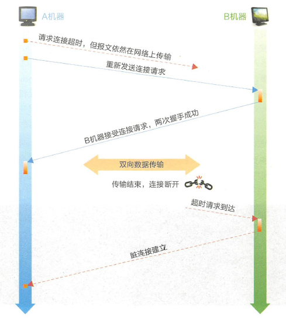
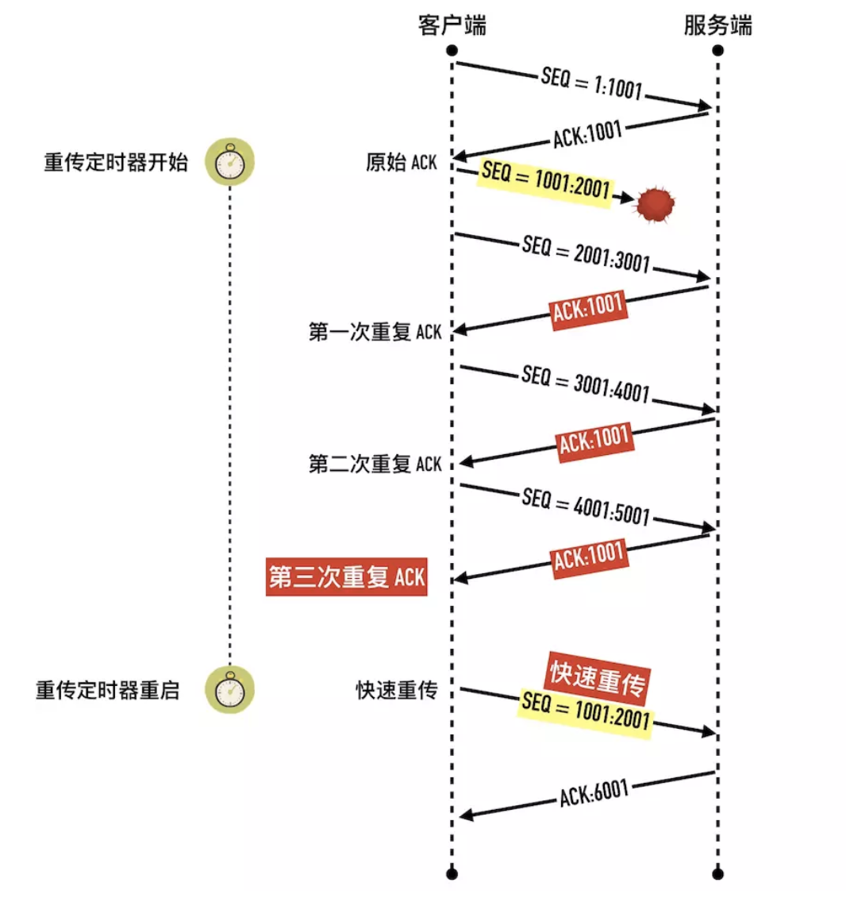

# TCP

## 介绍

程序在发送消息时，应用层接既定的协议打包数据， 随后由**传输层加上双方的端口号，由网络层加上双方的IP 地址，由链路层加上双方的MAC 地址， 并将数据拆分成数据帧**， 经过多个路由器和网关后， 到达目标机器。简而言之， 就是按“ 端口→ IP 地址→ MAC 地址” 这样的路径进行数据的封装和发送， 解包的时候反过来操作即可。

**特点**

- TCP是面向连接（虚连接）的传输层协议。打call
- 每一条TCP连接只能有两个端点(ip + 端口号)，每一条TCP连接只能是点对点的。
- TCP提供可靠交付的服务，无差错、不丢失、不重复、按序到达。**可靠有序，不丢不重**
- TCP提供全双工通信。
        -  发送缓存：准备发送的数据  +  己发送但尚未收到确认的数据
        -  接收缓存：按序到达但尚未被接受应用程序读取的数据  +  不按序到达的数据
 - TCP面向字节流TCP把应用程序交下来的数据看成仅仅是一连串的无结构的字节流。

## TCP与UDP

- 连接管理

- 可靠传输
  - 顺序传输
  - ACK
  - 超时重传
  - 差错处理 
- 流量控制

- 拥塞控制

## 报头

- 源端口 + 目的端口

  协议第一行的两个端口号各占两个字节（16bit 0-65535）,分别表示了源机器和目标机器的端口号。
  这两个端口号与 IP 报头中的源地址和目标IP地址所组成的四元组可唯一标识一条TCP 连接。

- 序号seq
  
  所发送数据包中数据部分第一个字节的序号
  
- 确认号ack
  
  期望收到来自对方的下一个数据包中数据部分第一个字节的序号
  
- 头部数据偏移 + 保留  + 6个flag  + 窗口
  
  - 头部数据偏移4bit，单位4B，标志数据部分开头偏移量
  
    由于 TCP 报头中存在一些扩展字段,所以需要通过长度为 4 个 bit 的头部长度字段表示 TCP 报头的大小,这样接收方才能准确地计算出包中数据部分的开始位置。
  
  - 保留位6bit
  
  - 6个flag
  
    TCP 的 FLAG 位由 6 个 bit 组成,分别代表 ACK 、 SYN 、 FIN、 URG 、 PSH 、RST ,都以置 1 表示有效.
  
    SYN ( Synchronize  Sequence Numbers )用作建立连接时的同步信号 
  
    ACK ( Acknowledgement )用于对收到的数据进行确认,所确认的数据由确认序列号表示。连接建立后所有报文ACK都是1.
  
    FIN ( Finish )表示后面没有数据需要发送,通常意昧着所建立的连接需要关闭了。
  
    URG 紧急标志位：发送方直接处理，不走发送缓存队列，配合紧急指针使用
  
    PSH：PSH=1时，接收方尽快交付接收应用进程，不再等到缓存填满再向上交付。
  
    RST：复位，TCP连接严重差错，释放后重新连接。
  
  -  窗口大小
  
    发送本报文段一方的接受窗口，即现在允许对方发送的数据量

  

- 校验和 + 紧急指针
  
  检验和：检验首部+数据，检验时要加上12B伪首部，第四个字段为6（TCP协议），7（UDP协议）。
  
  紧急指针：URG=1时才有意义，指出本报文段中紧急数据的字节数（从数据开头到它指示的结尾是紧急数据）。
  
- 选项+填充

## 连接管理

### 三次握手

注意两端状态的变化

1.客户端发送的一个段是 SYN 报文，这个报文只有 SYN 标记被置位,数据段长度为 0。

SYN 报文不携带数据，但是它占用一个序号，下次发送数据序列号要加一。客户端会随机选择一个数字作为初始序列号（ISN）.

> 凡是消耗序列号的 TCP 报文段，一定需要对端确认。如果这个段没有收到确认，会一直重传直到达到指定的次数为止。

2.服务端收到客户端的 SYN 段以后，将 SYN 和 ACK 标记都置位1

SYN 标记的作用与步骤 1 中的一样，也是同步服务端生成的初始序列号。ACK 用来告知发送端之前发送的 SYN 段已经收到了，「确认号」字段指定了发送端下次发送段的序号，这里等于客户端 ISN 加一。 与前面类似 SYN + ACK 端虽然没有携带数据，但是因为 SYN 段需要被确认，所以它也要消耗一个序列号。

3.客户端发送三次握手最后一个 ACK 段，这个 ACK 段用来确认收到了服务端发送的 SYN 段。因为这个 ACK 段不携带任何数据，且不需要再被确认，这个 ACK 段不消耗任何序列号。

**初始序列号（Initial Sequence Number, ISN**

初始的序列号并非从 0 开始，通信双方各自生成，一般情况下两端生成的序列号不会相同。生成的算法是 ISN 随时间而变化，会递增的分配给后续的 TCP 连接的 ISN。

一个建议的算法是设计一个假的时钟，每 4 微妙对 ISN 加一，溢出 2^32 以后回到 0，这个算法使得猜测 ISN 变得非常困难。

### 三次握手的状态变化

### 为什么不是两次握手？  

#### 信息对等

  A ----SYN=1,seq=x------------------------------> B // 成功 B确认:B机器收，A机器发    
  A <---SYN=1,seq=y,ACK=1,ack=x+1---------- B // 成功 A确认:A机器发，A机器收，B机器收，B机器发   
  A ----seq=x+1,ACK=1,ack=y+1---------------> B // 成功 B确认:A机器收，B机器发

双方都确认了自己的收发能力和对方的收发能力。

#### 防止脏连接

  

两次就建立连接是危险的行为，以B机器为例子，只要收到A机器的请求就建立连接。

TTL 网络报文的生存时间往往都会超过 TCP 请求超时时间 , 如果两次握手就可以创建连接 , 传输数据并释放连
接后 , 第一个超时的连接请求才到达 B 机器的话 , B 机器会以为是 A 创建新连接的请求 , 然后确认同意创建连接。因为 A 机器的状态不是 SYN_SENT , 所以直接丢弃了 B 的确认数据 , 以致最后只是 B 机器单方面创建连接完毕 .

而如果是三次握手， 则B 机器收到连接请求后，同样会向A 机器确认同意创建连接，但因为A 机器不是SYN SENT 状态，所以会直接丢弃， B 机器由于长时间没有收到确认信息， 最终超时导致连接创建失败，因而不会出现脏连接。

### 四次挥手

男生：我们分手吧。
女生：好的,我的东西收拾完,发信息给你。( 此时男生不能再拥抱女生了。)
( 1 个小时后)
女生：我收拾好了,分手吧。
男生：好的(此时 , 女生也不能再拥抱男生了)
(此时 , 双方约定经过 2 个月的过渡期,双方才可以分别找新的对象)

1、客户端调用 `close` 方法，执行「主动关闭」，会发送一个 FIN 报文给服务端，从这以后客户端不能再发送数据给服务端了，客户端进入`FIN-WAIT-1`状态。FIN 报文其实就是将 FIN 标志位设置为 1。

FIN 段是可以携带数据的，比如客户端可以在它最后要发送的数据块可以“捎带” FIN 段。当然也可以不携带数据。如果 FIN 段不携带数据的话，需要消耗一个序列号。

客户端发送 FIN 包以后不能再发送数据给客户端，但是还可以接受服务端发送的数据。这个状态就是所谓的「半关闭（half-close）」

主动发起关闭的一方称为「主动关闭方」，另外一段称为「被动关闭方」。

2、服务端收到 FIN 包以后回复确认 ACK 报文给客户端，服务端进入 `CLOSE_WAIT`，客户端收到 ACK 以后进入`FIN-WAIT-2`状态。

3、服务端也没有数据要发送了，发送 FIN 报文给客户端，然后进入`LAST-ACK` 状态，等待客户端的 ACK。同前面一样如果 FIN 段没有携带数据，也需要消耗一个序列号。

4、客户端收到服务端的 FIN 报文以后，回复 ACK 报文用来确认第三步里的 FIN 报文，进入`TIME_WAIT`状态，等待 2 个 MSL 以后进入 `CLOSED`状态。服务端收到 ACK 以后进入`CLOSED`状态

> **主动结束方会有TIME_WAIT** 两倍的MSL。被动关闭方可能会有**CLOSE_WAIT**

**为什么 FIN 报文要消耗一个序列号**

如三次握手的 SYN 报文一样，如果不携带数据，FIN 段也需要消耗一个序列号。我们用一个图来解释，如果 FIN 段不消耗一个序列号会发生什么。

如上图所示，如果 FIN 包不消耗一个序列号。客户端发送了 100 字节的数据包和 FIN 包，都等待服务端确认。如果这个时候客户端收到了ACK=1000 的确认包，就无法得知到底是 1000 字节的确认包还是 FIN 包的确认包。

### 为什么需要time_wait?

**对B机器负责**

如果B机器没有收到最后一次ACK，B机器会重发FIN+ACK。这样可以确保B机器进入closed状态   

**加一点空档间隔**

并且防止己失效连接的请求数据包与正常连接的请求数据包混淆而发生异常。

## 可靠传输

这依赖四种机制的保证

### 校验

伪首部

### 序号

给传输的字节编号

### 确认重传不分家

确认是ack确认

但是一旦出现报文丢失

重传包括以下两种：

**超时重传**

确认重传不分家，TCP的发送方在**规定的时间**内没有收到确认就要重传己发送的报文段。超时重传

规定的时间实际就是重传时间
TCP采用自适应算法，动态改变重传时间RTTs（加权平均往返时间）。

**冗余ACK，快速重传**机制

每当比期望序号大的失序报文段到达时，发送一个**冗余ACK**，指明下一个期待字节的序号。
发送方己发送1，2，3，4，5报文段
接收方收到1，返回给1的确认（确认号为2的第一个字节）
接收方收到3，仍返回给1的确认（确认号为2的第一个字节）
接收方收到4，仍返回给1的确认（确认号为2的第一个字节）
接收方收到5，仍返回给1的确认（确认号为2的第一个字节）
发送方收到**3个对于报文段1的冗余ACK**，认为2报文段丢失，重传2号报文段 （快速重传技术）

## 流量控制 -- 滑动窗口

是对发送方的一种控制，让发送方发慢点，接收方来得及接受。

TCP使用滑动窗口机制实现流量控制

### 滑动窗口

在通信过程中，接收方根据自己接收缓存的大小，动态地调整发送方的发送窗口大小，即接收窗口rwnd（接收方设置确认报文段的窗口字段来将rwnd通知给发送方）,发送方的发送窗口取接收窗口rwnd和拥塞窗口cwnd的最小值

**实例**

A B连接建立，B告诉A rwnd是400字节，设每个报文段100B，报文序列号初始值为1

**发送一个rwnd=0后，下一条滑动窗口通知丢失如何解决？**

TCP为每一个连接设有一个持续计时器，只要TCP连接的一方收到对方的零窗口通知，就启动持续计时器。

若持续计时器设置的时间到期，就发送一个零窗口探测报文段。
接收方收到探测报文段时给出现在的窗口值。若窗口仍然是0，那么发送方就重置持续计时器。

## 拥塞控制

出现拥塞的条件：对资源需求的总和>可用资源

这里的资源比如网络带宽，以及中转节点缓存（路由器）等

一旦网络中有很多资源同时呈现供应不足，网络的吞吐量将随输入负荷增大而下降.

拥塞控制是从整个网络的大局观来思考的，如果没有拥塞控制，某一时刻网络的时延增加、丢包频繁，发送端疯狂重传，会造成网络更重的负担，而更重的负担会造成更多的时延和丢包，形成雪崩的网络风暴。

**拥塞控制就是防止过多的数据注入到网络中**，这是一个全局性的控制

假定：
1．数据单方向传送，而另一个方向只传送确认
2．接收方总是有足够大的缓存空间，因而发送窗口大小取决于拥塞程度

发送窗口=Min{接收窗口rwnd，拥寒窗口cwnd}

接收窗口：**接收方**根据接受缓存设置的值，并告知给发送方，**反映接收方容量**。
拥塞窗口：**发送方**根据自己估算的网络拥塞程度而设置的窗口值，**反映网络当前容量**。

### 慢开始 + 拥塞避免

 

纵坐标的单位是报文段

横坐标的单位是轮次：

一个传输轮次是发送了一批报文段并收到它们的确认的时间。一个往返RTT，或者说开始发送一批拥塞
窗口内的报文段到开始发送下一批拥塞窗口内的报文段的时间。

**慢启动:**

在连接建立之初，应该发多少数据给接收端才是合适的呢？

你不知道对端有多快，如果有足够的带宽，你可以选择用最快的速度传输数据，但是如果是一个缓慢的移动网络呢？如果发送的数据过多，只是造成更大的网络延迟。这是基于整个考虑，每个 TCP 连接都有一个拥塞窗口的限制，最初这个值很小，随着时间的推移，**每次发送的数据量如果在不丢包的情况下，“慢慢”的递增，这种机制被称为「慢启动**

慢启动的过程如下:

- 第一步，三次握手以后，双方通过 ACK 告诉了对方自己的接收窗口（rwnd）的大小，之后就可以互相发数据了
- 第二步，通信双方各自初始化自己的「拥塞窗口」（Congestion Window，cwnd）大小。
- 第三步，cwnd 初始值较小时，每收到一个 ACK，cwnd + 1，每经过一个 RTT，cwnd 变为之前的两倍。

**慢启动阈值（Slow Start Threshold，ssthresh）**

慢启动拥塞窗口（cwnd）肯定不能无止境的指数级增长下去，否则拥塞控制就变成了「拥塞失控」了，它的阈值称为「慢启动阈值」（Slow Start Threshold，ssthresh），ssthresh 就是一道刹车，让拥塞窗口别涨那么快。

- 当 cwnd < ssthresh 时，拥塞窗口按指数级增长（慢启动）
- 当 cwnd > ssthresh 时，拥塞窗口按线性增长（拥塞避免)

**拥塞避免（Congestion Avoidance）**

当 cwnd > ssthresh 时，拥塞窗口进入「拥塞避免」阶段，在这个阶段，每一个往返 RTT，拥塞窗口大约增加 1 个 MSS 大小，直到检测到拥塞为止。

与慢启动的区别在于

- 慢启动的做法是 RTT 时间内每收到一个 ACK，拥塞窗口 cwnd 就加 1，也就是每经过 1 个 RTT，cwnd 翻倍
- 拥塞避免的做法保守的多，每经过一个RTT 才将拥塞窗口加 1，不管期间收到多少个 ACK.

### 快重传 + 快恢复

 

利用冗余ACK

**快重传**

快速重传的含义是：当接收端收到一个不按序到达的数据段时，TCP 立刻发送 1 个重复 ACK，而不用等有数据捎带确认，当发送端收到 3 个或以上重复 ACK，就意识到之前发的包可能丢了，于是马上进行重传，不用傻傻的等到重传定时器超时再重传。

**选择确认(Selective Acknowledgment，SACK)**

这个有一个问题，发送 3、4、5 包收到的全部是 ACK=1001，快速重传解决了一个问题: 需要重传。因为除了 2 号包，3、4、5 包也有可能丢失，那到底是只重传数据包 2 还是重传 2、3、4、5 所有包呢？

聪明的网络协议设计者，想到了一个好办法

- 收到 3 号包的时候在 ACK 包中告诉发送端：喂，小老弟，我目前收到的最大连续的包序号是 **1000**（ACK=1001），[1:1001]、[2001:3001] 区间的包我也收到了
- 收到 4 号包的时候在 ACK 包中告诉发送端：喂，小老弟，我目前收到的最大连续的包序号是 **1000**（ACK=1001），[1:1001]、[2001:4001] 区间的包我也收到了
- 收到 5 号包的时候在 ACK 包中告诉发送端：喂，小老弟，我目前收到的最大连续的包序号是 **1000**（ACK=1001），[1:1001]、[2001:5001] 区间的包我也收到了

这样发送端就清楚知道只用重传 2 号数据包就可以了，数据包 3、4、5已经确认无误被对端收到。这种方式被称为 SACK（Selective Acknowledgment）。

**快恢复**

当收到三次重复 ACK 时，进入快速恢复阶段。解释为网络轻度拥塞。

- 拥塞阈值 ssthresh 降低为 cwnd 的一半：ssthresh = cwnd / 2
- 拥塞窗口 cwnd 设置为 ssthresh
- 拥塞窗口线性增加

## 总结

 

1、TCP 协议三次握手建立一个连接，第二次握手的时候服务器所处的状态是（）

- A、SYN_RECV
- B、ESTABLISHED
- C、SYN-SENT
- D、LAST_ACK

A

2、下面关于三次握手与connect()函数的关系说法错误的是（）

- A、客户端发送 SYN 给服务器
- B、服务器只发送 SYN 给客户端
- C、客户端收到服务器回应后发送 ACK 给服务器
- D、connect() 函数在三次握手的第二次返回

B

1、HTTP传输完成，断开进行四次挥手，第二次挥手的时候客户端所处的状态是：

- A、CLOSE_WAIT
- B、LAST_ACK
- C、FIN_WAIT2
- D、TIME_WAIT

C

2、正常的 TCP 三次握手和四次挥手过程（客户端建连、断连）中，以下状态分别处于服务端和客户端描述正确的是

- A、服务端：SYN-SEND，TIME-WAIT 客户端：SYN-RCVD，CLOSE-WAIT
- B、服务端：SYN-SEND，CLOSE-WAIT 客户端：SYN-RCVD，TIME-WAIT
- C、服务端：SYN-RCVD，CLOSE-WAIT 客户端：SYN-SEND，TIME-WAIT
- D、服务端：SYN-RCVD，TIME-WAIT 客户端：SYN-SEND，CLOSE-WAIT

C