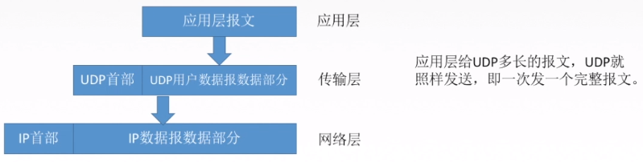
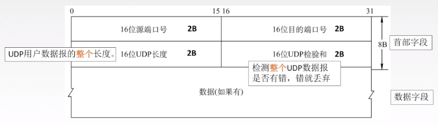

# UDP协议

## 介绍

UDP只是在IP数据报上增加很少的功能，复用、分用+差错检测。

### 特点

无连接+不可靠

1.UDP是无连接的，减少开销和发送数据之前的时延。
2.UDP使用最大努力交付，即不保证可靠交付
3.UDP是面向报文的，适合一次性传输少量数据的网络应用。

4.无拥塞控制，适合实时应用

5.首部开销小，8B，TCP20B

## 首部格式

分用时，找不到对应的目的端口号，就丢弃报文，并给发送方发送℃MP“端口不可达”差错报告报文。

源端口号是可以空的，UDP无连接

## 差错控制 - 检验和

