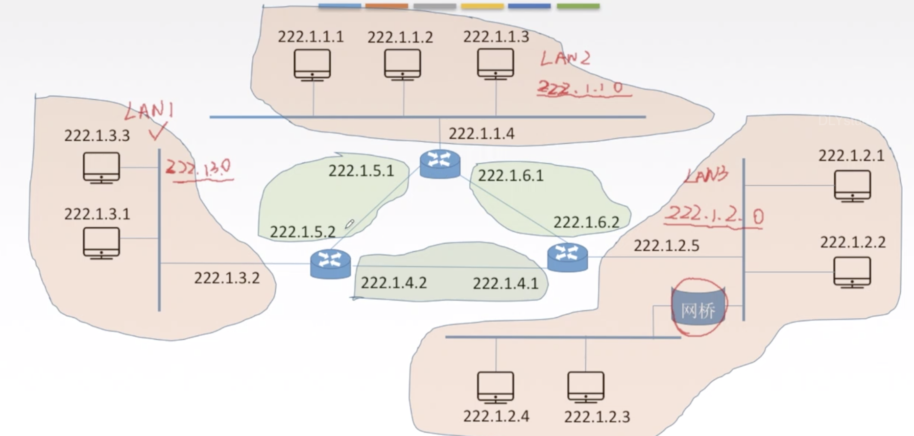
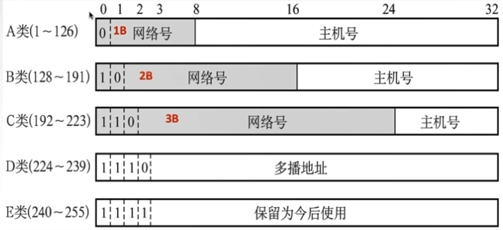
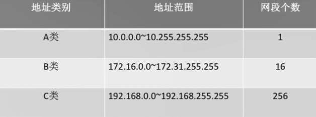
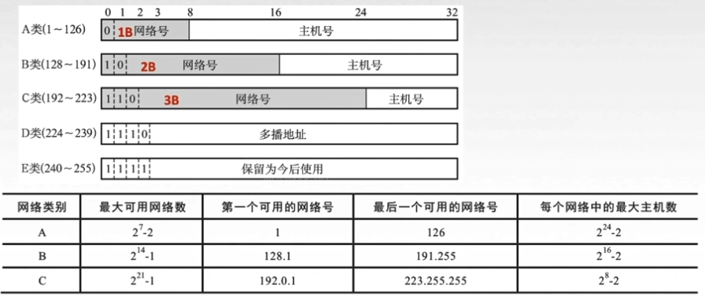

## IPV4

IP地址：全世界唯一的32位/4字节标识符,标识路由器主机的接口(不同接口可以绑定不同的)

IP地址：{<网络号>，<主机号>}

**主机号全0,网络号可以标识一个局域网.**

ps:网桥不分割局域网

### 分类的IP地址

### 特殊的IP地址

| NetID 网络号 | HostID 主机号 | 作为源地址 | 作为目的地址 | 用途 |
| ----------------- | ---- | ---- | ---- | ---- |
| 全0 | 全0 | 可以 | 不可以 | 0.0.0.0本网范围内表示主机(自己)，路由表中表示默认路由（整个Internet网络） |
| 全0 | 特定值 | 不可以 | 可以 | 表示**本网**内某个特定主机 |
| 全1(255) | 全1（255） | 不可以 | 可以 | 255.255.255.255本网广播地址（路由器不转发,隔离广播域） |
| 特定值 | 全0 | 不可以 | 不可以 | **网络地址，表示一个网络** |
| 特定值 | 全1（255） | 不可以 | 可以 | 直接广播地址，对其他特定网络上所有主机进行广播 |
| 127 | 任何数（非全0/1） | 可以 | 可以 | 用户本地软件环回地址，环回地址 |
|                   |      |      |      |      |

> 主机号全1 代表广播

##### 私有IP地址（内部网络使用） 

在这ABC三类地址中，绝大多数的IP地址都是**公有地址**，需要向国际互联网信息中心申请注册。但是在IPv4地址协议中预留了3个IP地址段，作为**私有地址**，供组织机构内部使用。

路由器对私有IP地址一律不转发

##### 分类的IP地址

**A类:**

网络号全0表示本网络

或者为127

所以1-126

主机号要减去2 

- 全0 主机号全0,网络号
- 全1 广播

**B类**

去掉一个全0

**C类**

去掉一个全0