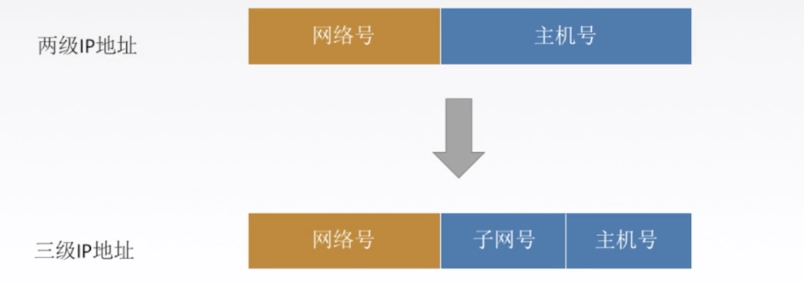
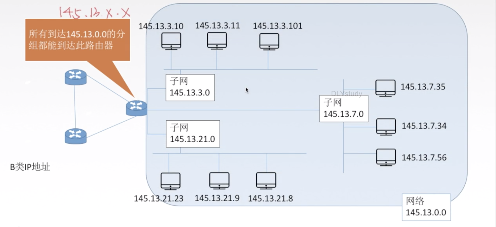
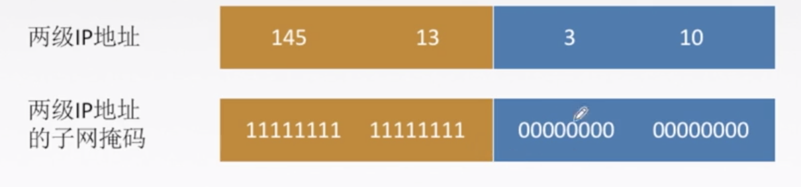
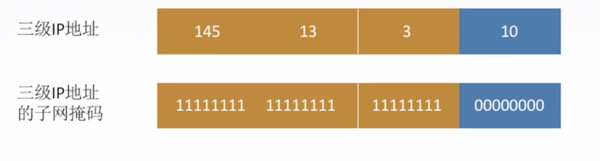
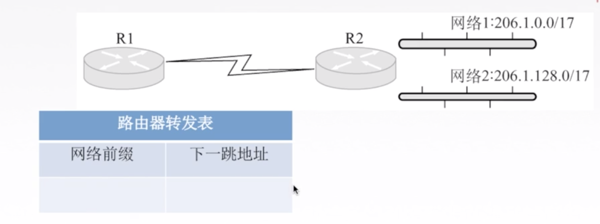

## 子网划分

### 介绍



> 对外仍然为一个网络
>
> 主机号不能全0(本网络)/全1(广播),所以主机号至少两位


**子网号能否全0/全1看情况.**

### Demo




### 子网掩码



三级



子网掩码与 IP 地址逐位相与，就得到子网网络地址。

**practice1**

已知 IP 地址是 141.14.72.24, 子网掩码是 255.255.192.0, 求网络地址。

```
01001000
11000000
----------
01000000   = 64
```

| 二进制     | 10进制 |
| ---------- | ------ |
| `10000000` | 128    |
| `11000000` | 192    |
| `11100000` | 224    |
| `11110000` | 240    |
| `11111000` | 248    |
| `11111100` | 252    |
| `11111110` | 254    |
| `11111111` | 255    |

141.14.64.0


**practice2**

某主机的 IP 地址为 180.80.77.55, 子网掩码为 255.255.252.0。若该主机向其所在子发送广播分组，则目的地址可以是（)

A.180.80.76.0 B.180.80.76.255 C.180.80.77.255 D.180.80.79.255


D


## 无分类编址 CIDR

无分类域间路由选择 CIDR

1. 消除了传统的 A 类,B 类和C类地址以及划分子网的概念。


CIDR 记法：IP 地址后加上“/”，然后写上网络前缀 (可以任意长度)的位数。e.g.128.14.32.0/20.

2. 融合子网地址与子网掩码，方便子网划分 

   **CIDR 把网络前缀都相同的连续的IP地址组成一个“CIDR 地址块”。**

```
128.14.35.7/20是某CIDR地址块中的一个地址进制：
10000000001100010001100000011
-----------------

最小地址
10000000001100010000000000000
-----------------
128.14.32.0

最大地址
10000000001100010111111111111
-----------------
128.14.47.255


子网掩码 20个1,12个0
```


## 超网

### 介绍

将多个子网聚合成一个较大的子网，叫做构成超网，或路由聚合。

将网络前缀缩短




### 最长前缀匹配

使用 CIDR 时，査找路由表可能得到几个匹配结果，应选择具有最长网络前缀的路由。前缀越长，地址块越小，路由越具体。

```
路由器RO的路由表见下表：若进入路由器 RO 的分组的目的地址为132.19.237.5, 请问该分组应该被转发到哪一个下一跳路由器（)

A. R1 B. R2 C. R3 D. R4

目的网络         下一跳

132.0.0.0/8     R1

132.0.0.0/11    R2

132.19.232.0/22 R3

0.0.0.0/0       R4          默认路由
```


B


```
某网络的IP地址空间为192.168.5.0/24,采用定长子网划分,子网掩码为255.255.255.248,则该网络中的最大子网个数、每个子网内的最大可分配地址个数分别是（）。

A.32,8 
B.32,6 
C.8,32 
D.8,30
```

CIDR允许子网号全0全1


B