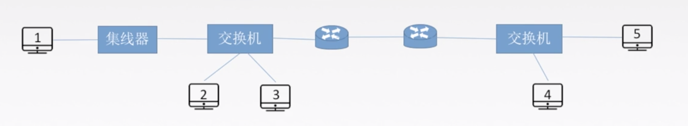
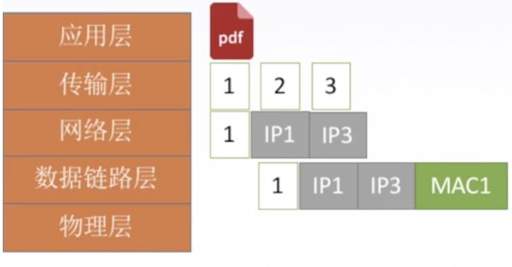
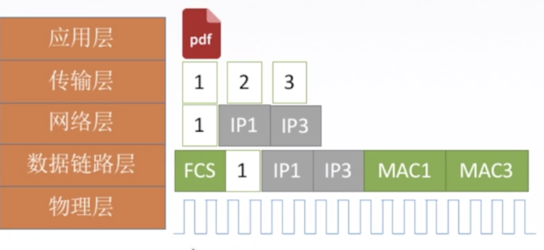
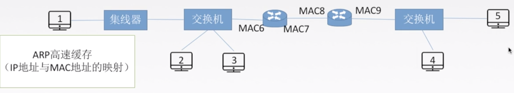

## 发送数据的过程

**发送过程**

在网络层要把IP1和IP3,转化为mac地址。MAC1和MAC3

## ARP介绍

 每个机器都有ARP 高速缓存（IP 地址与 MAC 地址的映射）,当本地缓存查不到的时候, 

需要发送**广播ARP请求分组.**

目的主机收到后,会返回**一个单播响应分组**

有了目的mac地址,就可以在数据链路层传输了

> FCS：Frame Check Sequence（帧校验序列），俗称帧尾，即计算机网络数据链路层的协议数据单元（帧）的尾部字段，是一段4个字节的循环冗余校验码。

如果请求的地址不在同一网络:

1号主机,要和5号主机通信.

则要先拿到本网络的网关的mac地址,然后再往外发送.

由于在实际网络的**链路上传送数据帧时，最终必须使用 MAC 地址**。

ARP 协议：完成主机或路由器 IP 地址到 MAC 地址的映射。解决下一跳走哪的问题.

## ARP协议使用过程

检査 **ARP 高速缓存**，有对应表项则写入 MAC 帧，没有则用目的 MAC 地址为 FF-FFF-F-FF-FF 的帧封装并**广播 ARP 请求分组**.

同一局域网中所有主机都能收到该请求。目的主机收到请求后就会向源主机**单播一个 ARP 响应分组**，**源主机收到后将此映射写入 ARP 缓存（10-20 min 更新一次）。**

ARP 协议 4 种典型情况：

1. 主机 A 发给本网络上的主机 B：用 ARP 找到主机 B 的硬件地址
2. 主机 A 发给另一网络上的主机 B：用 ARP 找到本网络上ー个路由器（网关）的硬件地址 
3. 路由器发给本网络的主机 A：用 ARP 找到主机 A 的硬件地址
4. 路由器发给另一网络的主机 B：用 ARP 找到本网络上的一个路由器的硬件地址(通向另一个网络的网关)。

## Practice

主机发送 IP 数据报给主机 B，经过了 5 个路由器，请问此过程总共使用了几次 ARP 协议？

6 次.

 	