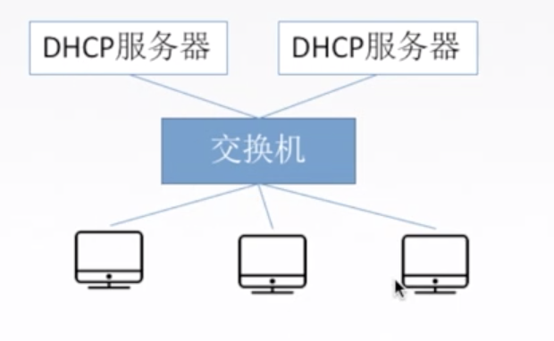

## 获得IP地址

### 静态配置

给每台机器配置IP地址,子网掩码,默认网关

### 动态配置

上大学的时候,进到一个教室就能连上wifi.

## DHCP协议

`动态主机配置协议DHCP`是**应用层协议**,使用客户/服务器方式,**客户端和服务端通过广播方式进行交互,基于UDP**。

DHCP 提供即插即用联网的机制，主机可以从服务器动态获取 IP 地址、子网掩码、默认网关、DNS 服务器名称.

允许**地址重用**，支持**移动用户加入网络**，支持**在用地址续租**。

## DHCP协议过程

1. 主机广播 **DHCP 发现**报文   

   “有没有 DHCP 服务器呀？”试图找到网络中的服务器，服务器获得一个 IP 地址。

2. DHCP 服务器广播 **DHCP 提供**报文 

   “有！”“有！”“有！”服务器拟分配给主机一个 P 地址及相关配置，先到先得。

3. 主机广播 **DHCP 请求**报文 

   “我用你给我的 IP 地址啦？”主机向服务器请求提供 IP 地址。

4. DHCP 服务器广播 **DHCP 确认**报文

   “用吧！”正式将 IP 地址分配给主机

> 均使用广播的方式,可以通知多个DHCP服务器