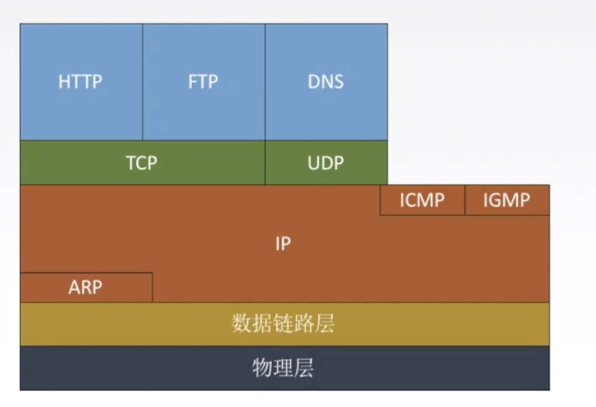
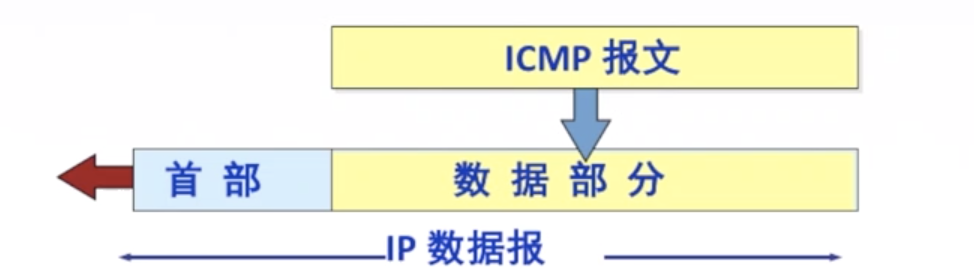
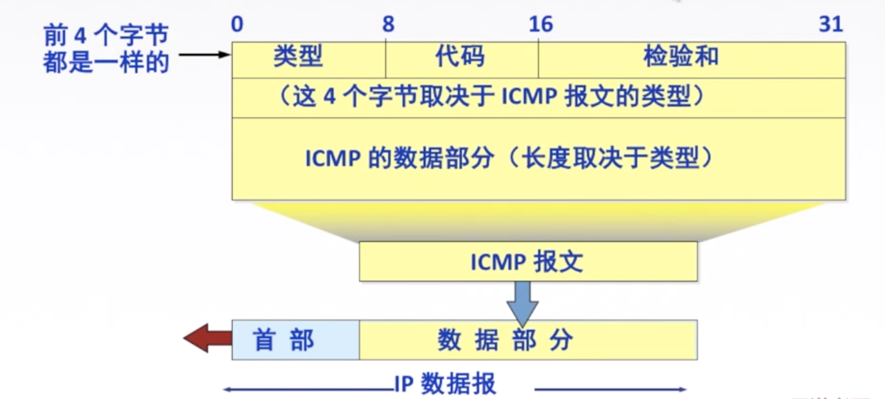
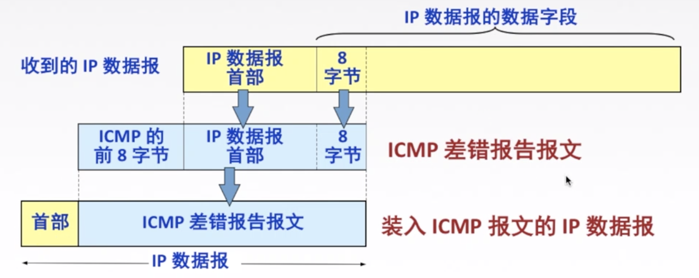

## TCP/IP协议栈

## ICMP(Internet Control Message Protocol)

网际控制报文协议

**作用**

ICMP 协议支持主机或路由器：

- 差错（或异常）报告   
- 网络探询

会发送ICMP报文

## ICMP报文

存放在IP数据报的数据部分.

详细:

一共8字节

## ICMP报文种类

### ICMP差错报告报文

1. 终点不可达：当路由器或主机不能交付数据报时就向源点发送终点不可达报文。

​      **无法交付**

2.  时间超过：

   当**路由器收到生存时间 TTL=0 的数据报**时，除丢弃该数据报外，还要向源点发送时间超过报文。

   当**终点在预先规定的时间内不能收到一个数据报的全部数据报片**时，就把已收到的数据报片都丢弃，并向源点发送时间超过报文.

3. 参数问题：当路由器或目的主机收到的数据报的首部中有的字段的值不正确时，就丢弃该数据报，并向源点发送参数问题报文。

   **首部字段有问题**

4. 改变路由（重定向）：路由器把改变路由报文发送给主机**，让主机知道下次应将数据报发送给另外的路由器（可通过更好的路由）**。

   **值得更好的路由**

差错报告报文的具体字段

**不发送ICMP差错报告报文:**

1. 对 ICMP 差错报告报文不再发送 ICMP 差错报告报文。

2. 对第一个分片的数据报片的**所有后续数据报片都不发送 ICMP 差错报告报文**。

3. 对具有组播地址的数据报都不发送 ICMP 差错报告报文

   > 广播是所有地址,组播是多个地址

4. 对具有特殊地址（如 127.0.0.0 或 0.0.0.0) 的数据报不发送 ICMP 差错报告报文

### ICMP询问报文

1. 回送请求和回答报文主机或路由器向特定目的主机发出的询问，收到此报文的主机必须给源主机或路由器发送 ICMP 回送回答报文。

   **测试目的站是否可达以及了解其相关状态。****ping**

2. 时间戳请求和回答报文请某个主机或路由器回答当前的日期和时间。

   用来进行时钟同步和测量时间。

## 应用

### Ping

测试两个主机之间的连通性，使用了 ICMP 回送请求和回答报文。

ping 命令是基于 ICMP 协议来工作的，「 ICMP 」全称为 Internet 控制报文协议（[Internet Control Message Protocol](https://link.zhihu.com/?target=https%3A//tools.ietf.org/html/rfc792)）。ping 命令会发送一份ICMP回显请求报文给目标主机，并等待目标主机返回ICMP回显应答。因为ICMP协议会要求目标主机在收到消息之后，必须返回ICMP应答消息给源主机，如果源主机在一定时间内收到了目标主机的应答，则表明两台主机之间网络是可达的。

#### 过程

**1）**假设有两个主机，主机A（192.168.0.1）和主机B（192.168.0.2），现在我们要监测主机A和主机B之间网络是否可达，那么我们在主机A上输入命令：ping 192.168.0.2；

**2）**此时，ping命令会在主机A上构建一个 ICMP的请求数据包（数据包里的内容后面再详述），然后 ICMP协议会将这个数据包以及目标IP（192.168.0.2）等信息一同交给IP层协议；

**3）**IP层协议得到这些信息后，将源地址（即本机IP）、目标地址（即目标IP：192.168.0.2）、再加上一些其它的控制信息，构建成一个IP数据包；

**4）**IP数据包构建完成后，还不够，还需要加上MAC地址，因此，还需要通过ARP映射表找出目标IP所对应的MAC地址。当拿到了目标主机的MAC地址和本机MAC后，一并交给数据链路层，组装成一个数据帧，依据以太网的介质访问规则，将它们传送出出去；

**5）**当主机B收到这个数据帧之后，会首先检查它的目标MAC地址是不是本机，如果是就接收下来处理，接收之后会检查这个数据帧，将数据帧中的IP数据包取出来，交给本机的IP层协议，然后IP层协议检查完之后，再将ICMP数据包取出来交给ICMP协议处理，当这一步也处理完成之后，就会构建一个ICMP应答数据包，回发给主机A；

**6）**在一定的时间内，如果主机A收到了应答包，则说明它与主机B之间网络可达，如果没有收到，则说明网络不可达。除了监测是否可达以外，还可以利用应答时间和发起时间之间的差值，计算出数据包的延迟耗时。

#### **禁止ping**

https://www.cnblogs.com/chenshoubiao/p/4781016.html

### Traceroute

跟踪一个分组从源点到终点的路径，使用了 ICMP 时间超过差错报告报文。

把IP数据报的TTL从1逐渐增加,测算出路径中的每一个节点.

https://www.cnblogs.com/peida/archive/2013/03/07/2947326.html

