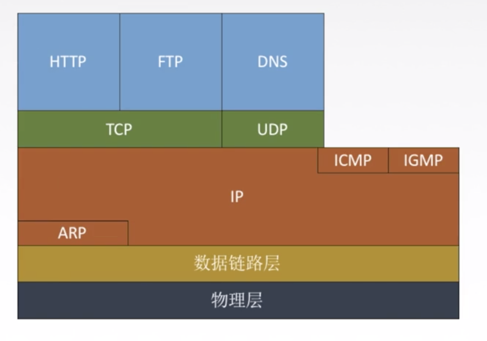
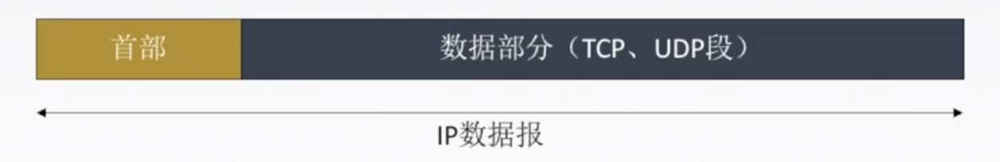
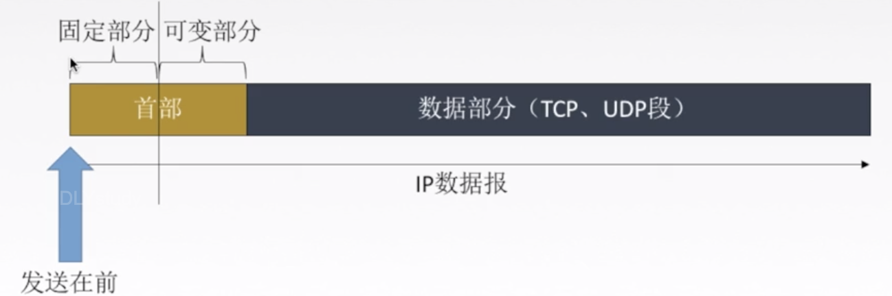
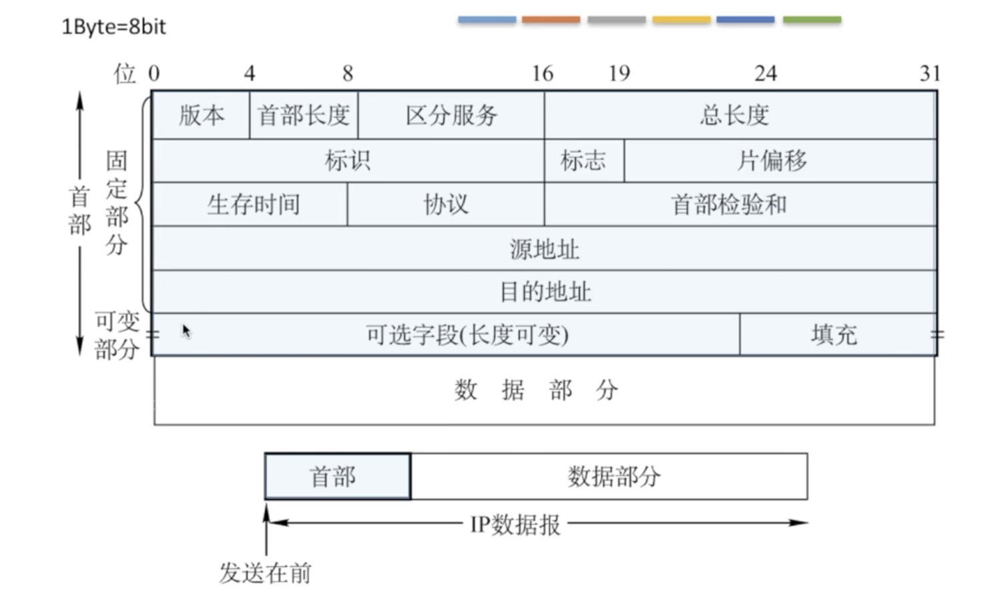
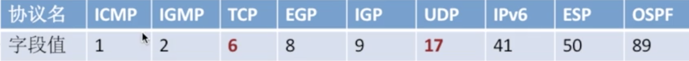

## TCP/IP协议栈

>arp协议在下面,为IP协议提供服务.同样IP协议也要为ICMP和IGMP提供服务

## IP数据包格式

> 发送时,从首部开始发送

**进一步细分**

**首部**

固定部分:20字节

可变部分:可以无,大部份时间没有

**数据部分**

传输层的报文段,暂不考虑

> 4字节,5行 共20字节

版本:IPV4/IPV6

首部长度:4bit 0-15.   **单位是4B**

区分服务:期望获得哪种类型的服务

总长度:0-65525 **单位是1B** 首部+数据部分 **实际永远不会达到.因为会分片**

生存时间:TTL,IP 分组的保质期。经过一个路由器-1, 变成 0 则丢弃。

协议:**数据部分使用的协议**。

TCP:面向连接,非常6

UDP:不面向连接,容易被遗弃,17.

首部校验和:

只检验首部.每次经过路由器都要重新检验.

源地址,目的地址

## IP数据包分片

**最大传输单元MTU**