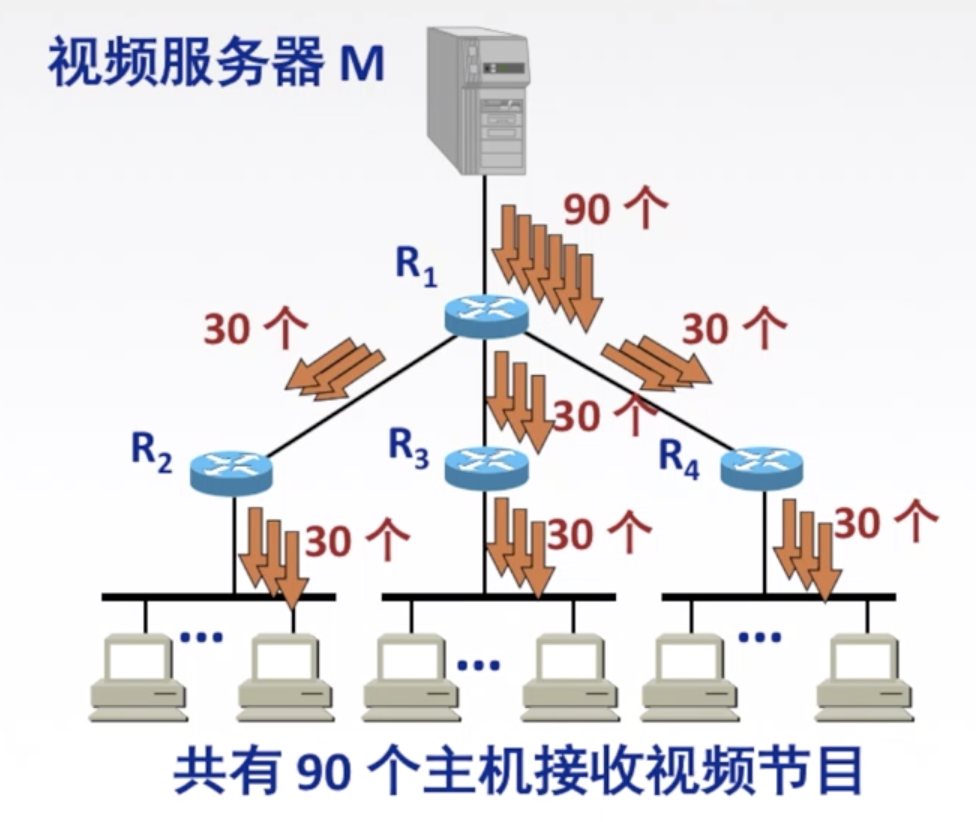
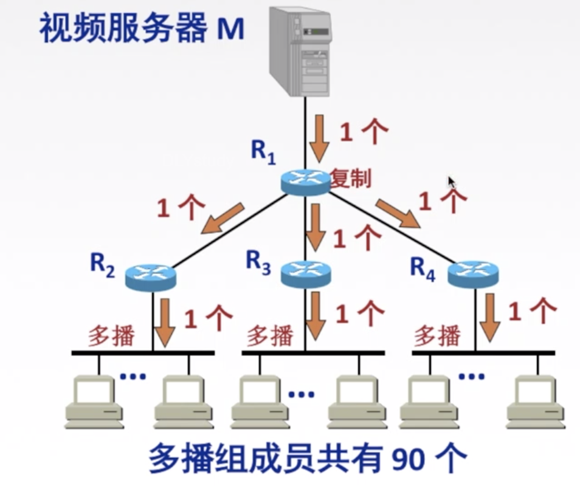
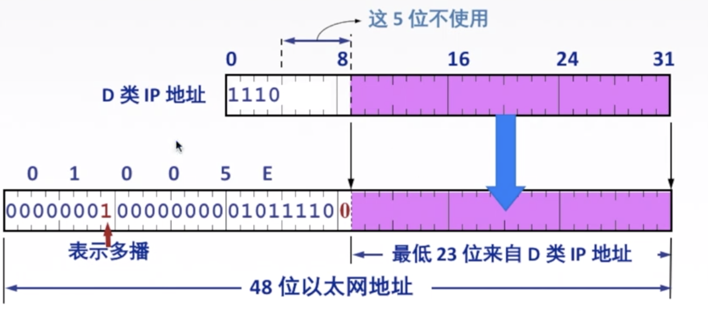
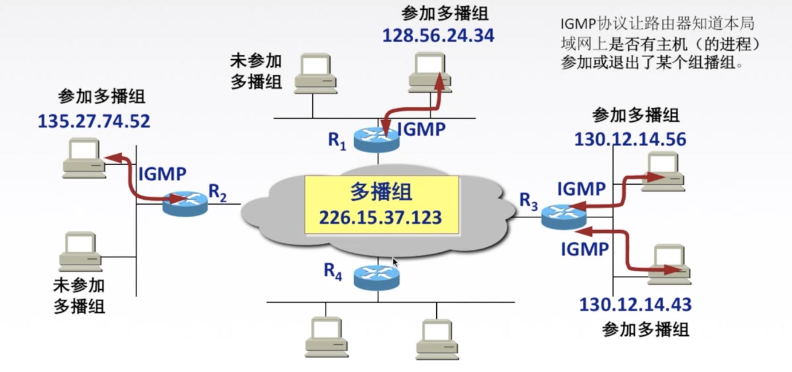
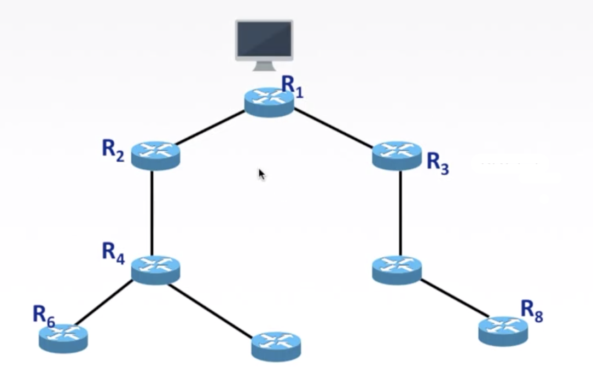

## TCP/IP协议栈

>ARP协议在下面,为IP协议提供服务.同样IP协议也要为ICMP和IGMP提供服务

## IP数据报格式

> 发送时,从首部开始发送

**进一步细分**

**首部**

固定部分:20字节

可变部分:可以无,大部份时间没有

**数据部分**

传输层的报文段,暂不考虑

> 4字节,5行 共20字节

版本:IPV4/IPV6

首部长度:4bit 0-15.   **单位是4B**

区分服务:期望获得哪种类型的服务

总长度:0-65525 **单位是1B** 首部+数据部分 **实际永远不会达到.因为会分片**

生存时间:TTL,IP 分组的保质期。经过一个路由器-1, 变成 0 则丢弃。

协议:**数据部分使用的协议**。

TCP:面向连接,非常6

UDP:不面向连接,容易被遗弃,17.

首部校验和:

只检验首部.每次经过路由器都要重新检验.

源地址,目的地址

## IP数据报分片

**最大传输单元MTU**

链路层数据帧可封装数据的上限。以太网的 MTU 是 1500 字节

如果超过,IP数据报会进行分片

**IP数据报格式**

IP数据报的分片就涉及到了首部中的标识,标志,片偏移.

- 标识

  同一数据报的分片使用同一标识。

- 标志

  标志只有 2 位有意义 x _ _ 

  中间位 DF (Don' t Fragment)

  - DF=1, 禁止分片

  - DF=0, 允许分片

  最低位 MF (More Fragment):

  - MF=1, 后面“还有分片” 

  - MF=0,代表最后一片/没分片

  只有DF=0 讨论MF才有意义

- 片偏移

  指出较长分组分片后，某片在原分组中的相对位置,以 8B为单位。

**Demo**

IP数据报如下:

需要分片为长度不超过 1420 B 的数据报片。

每个IP数据报需要20字节的首部,所以拆分三个分片如下:

第一部分0-1399  片偏移为0

第一部分1400-2799  片偏移为1400/8=175

第一部分2800-3799  片偏移为2800/8=350.

记忆法:

一种(总)8片的首饰(4).

总长度单位是 1 B 

片偏移单位是 8 B 

首部长度单位是 4 B

## IP数据报传输方式

### 介绍

- 单播

  单播用于发送数据包到单个目的地，且每发送一份单播报文都使用一个单播 IP 地址作为目的地址。是一种**点对点**传输方式

- 广播

  广播是指发送数据包到**同一广播域或子网内的所有设备**的一种数据传输方式是一种**点对多点传输方式。**

- 组播

  当网络中的某些用户需要特定数据时组播数据发送者仅发送一次数据，借助组播路由协议为组播数据报建立组播分发树，**被传递的数据到达距离用户端尽可能近的节点后才开始复制和分发**，是种**点对多点传输方式**。

### 单播

以视频网络为例子

发送者要和每个接受者建立单独的数据信道.

### 组播

**组播提高了数据传送效率。减少了主干网出现拥塞的可能性**。组播组中的主机可以是在同个物理网络，也可以来自不同的物理网络（如果有组播路由器的支持,可以运行组播协议的路由器）。

IP**组播地址**

IP 组播地址让源设备能够将分组发送给一组设备。属于多播组的设备将被分配一个**组播组 IP 地址（一群共同需求主机的相同标识）**。

组播地址范围为 224.0.0.0~239.255.255.255 (D 类地址），一个 D 类地址表示一个组播组。**只能用作分组的目标地址**。**源地址总是为单播地址**。

**组播注意事项**

1. 组播数据报也是“尽最大努力交付”，不提供可靠交付，应用于 **UDP**.
2. 对组播数据报不产生 ICMP 差错报文。
3. 并非所有 D 类地址都可以作为组播地址。

**硬件组播**

同单播地址一样，组播 IP 地址也需要相应的组播 MAC 地址在本地网络中实际传送帧。组播 MAC 地址以十六进制值 **01-00-5 E** 打头，余下的 6 个十六进制位是根据IP 组播组地址的最后 23 位转换得到的。

TCP/IP协议使用的以太网多播地址的范围是:

从 01-00-5 E-00-00-00 到 01-00-5 E-7 F-FF-FF

收到多播数据报的主机，还要在 IP 层利用软件进行过滤，把不是本主机要接收的数据报丢弃。

**因特网范围组播**

IGMP 组播路由选择协议

### IGMP协议

> 网际组管理协议 IGMP

IGMP 协议让路由器知道本**局域网上是否有主机（的进程）参加或退出了某个组播组**。

ICMP 和 IGMP 都使用 IP 数据报传递报文。

#### IGMP工作阶段

ROUND 1:

某主机要加入组播组时，该主机向组播组的组播地址发送一个 IGMP 报文，声明自己要称为该组的成员。

本地组播路由器收到 IGMP 报文后，要利用组播路由选择协议把这组成员关系发给因特网上的其他组播路由器。

ROUND 2:

本地组播路由器周期性探询本地局域网上的主机，以便知道这些主机是否还是组播组的成员。

只要有一个主机对某个组响应，那么组播路由器就认为这个组是活跃的：如果经过几次探询后没有一个主机响应，组播路由器就认为本网络上的没有此组播组的主机，因此就不再把这组的成员关系发给其他的组播路由器。

> 组播路由器知道的成员关系只是所连接的局域网中有无组播组的成员。

### 组播路由选择协议

组播路由选择协议目的是找出以源主机为根节点的组播转发树。

构造树可以避免在路由器之间兜圈子。

对不同的多播组对应于不同的多播转发树；同一个多播组，对不同的源点也会有不同的多播转发树。

组播路由选择协议常使用的三种算法

- 基于链路状态的路由选择

- 基于距离-向量的路由选择

- 协议无关的组播(稀疏/密集)