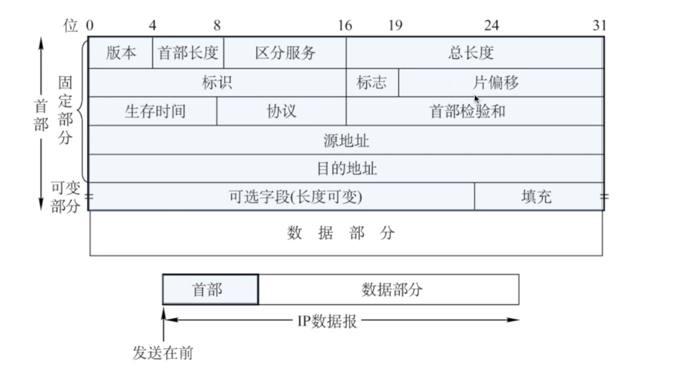
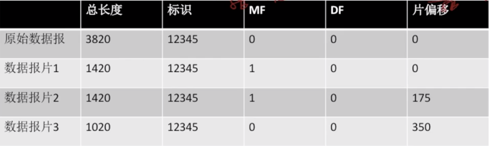

## TCP/IP协议栈

>ARP协议在下面,为IP协议提供服务.同样IP协议也要为ICMP和IGMP提供服务

## IP数据包格式

> 发送时,从首部开始发送

**进一步细分**

**首部**

固定部分:20字节

可变部分:可以无,大部份时间没有

**数据部分**

传输层的报文段,暂不考虑

> 4字节,5行 共20字节

版本:IPV4/IPV6

首部长度:4bit 0-15.   **单位是4B**

区分服务:期望获得哪种类型的服务

总长度:0-65525 **单位是1B** 首部+数据部分 **实际永远不会达到.因为会分片**

生存时间:TTL,IP 分组的保质期。经过一个路由器-1, 变成 0 则丢弃。

协议:**数据部分使用的协议**。

TCP:面向连接,非常6

UDP:不面向连接,容易被遗弃,17.

首部校验和:

只检验首部.每次经过路由器都要重新检验.

源地址,目的地址

## IP数据包分片

**最大传输单元MTU**

链路层数据帧可封装数据的上限。以太网的 MTU 是 1500 字节

如果超过,IP数据报会进行分片

**IP数据报格式**

IP数据报的分片就涉及到了首部中的标识,标志,片偏移.

- 标识

  同一数据报的分片使用同一标识。

- 标志

  标志只有 2 位有意义 x _ _ 

  中间位 DF (Don' t Fragment)

  - DF=1, 禁止分片

  - DF=0, 允许分片

  最低位 MF (More Fragment):

  - MF=1, 后面“还有分片” 

  - MF=0,代表最后一片/没分片

  只有DF=0 讨论MF才有意义

- 片偏移

  指出较长分组分片后，某片在原分组中的相对位置,以 8B为单位。

**Demo**

IP数据报如下:

需要分片为长度不超过 1420 B 的数据报片。

每个IP数据报需要20字节的首部,所以拆分三个分片如下:

第一部分0-1399  片偏移为0

第一部分1400-2799  片偏移为1400/8=175

第一部分2800-3799  片偏移为2800/8=350.

记忆法:

一种(总)8片的首饰(4).

总长度单位是 1 B 

片偏移单位是 8 B 

首部长度单位是 4 B

