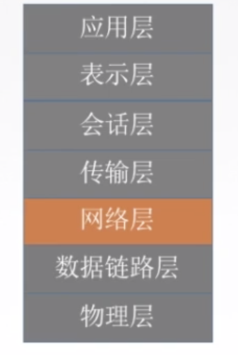

## 网络层

主要任务是把分组从源端传到目的端，**为分组交换网上的不同主机提供通信服务**。

**传输单位**是 数据报

网络层主要功能:

- 路由选择与分组转发(最佳路径)

- 异构网络互联 

- 拥塞控制

  若所有结点都来不及接受分组，而要丢弃大量分组的话，网络就处于拥塞状态。因此要采取一定措施，缓解这种拥塞。

## 目录

- 网络层概述

- IP数据报

- IP地址 
  - ipv4
  - nat
  - 子网划分
  - CIDR超网
  - ARP协议
  - DHCP协议
  - ICMP协议
  
- 路由算法与路由协议

- 组播

- 移动IP

- 网络层设备

  

