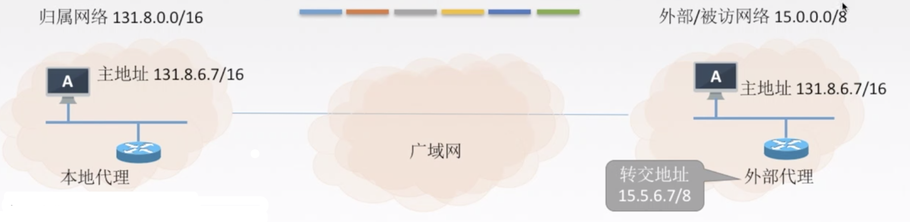

## 介绍

移动IP技术是移动结点(计算机/服务器等)以**固定的网络IP地址,实现跨越不同网段的漫游功能**,并保证了基于网络 IP 的网络权限在漫游过程中不发生任何改变。

`移动结点`:具有永久 IP 地址的移动设备。

`归属代理（本地代理）`:一个移动结点拥有的就“居所”称为归属网络，在归属网络中代表移动节点执行移动管理功能的实体叫做归属代理。

`外部代理（外地代理）`:在外部网络中帮助移动节点完成移动管理功能的实体称为外部代理。 `永久地址(归属地址/主地址)`:移动站点在归属网络中的原始地址。

`转交地址（辅地址）`: 移动站点在外部网络使用的临时地址。

## 移动IP通信过程

A 刚进入外部网络

1. 在外部代理登记获得一个转交地址，离开时注销。

2. 外地代理向本地代理登记转交地址。

B 给 A 发送数据报:

1. 本地代理截获数据报。

2. 本地代理再封装数据报，新的数据报目的地址是转交地址，发给外部代理（隧道）。

3. 外部代理拆封数据报并发给 A。

A 给 B 发送数据报:

A 用自己的主地址作为数据报源地址，用 B的 IP 地址作为数据报的目的地址。

A 移动到了下一个网络：

1. 在新外部代理登记注册一个转交地址。
2. 新外部代理给本地代理发送新的转交地址（覆盖旧的）。
3. 通信

A 回到了归属网络：

1. A 向本地代理注销转交地址。
2. 按照正常的原始方式通信