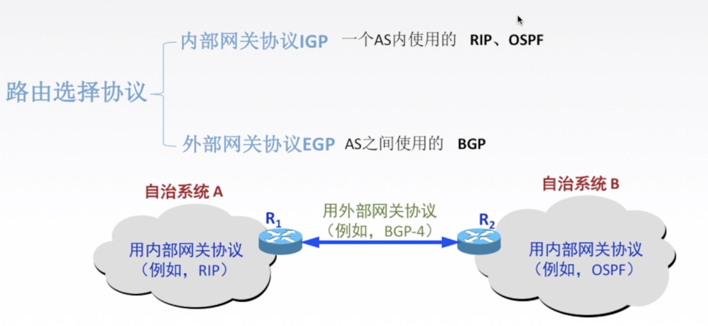
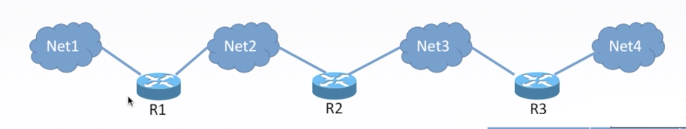
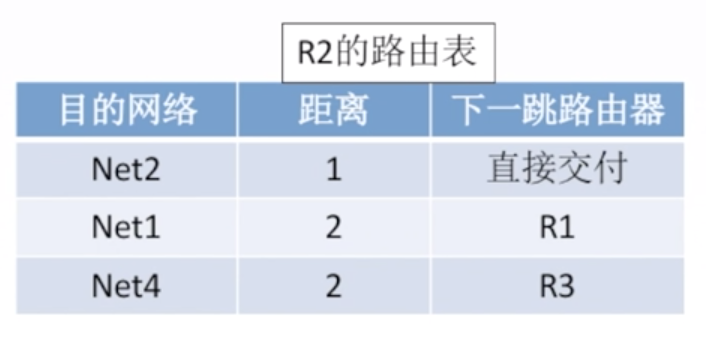
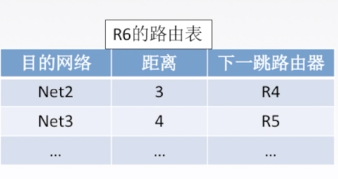
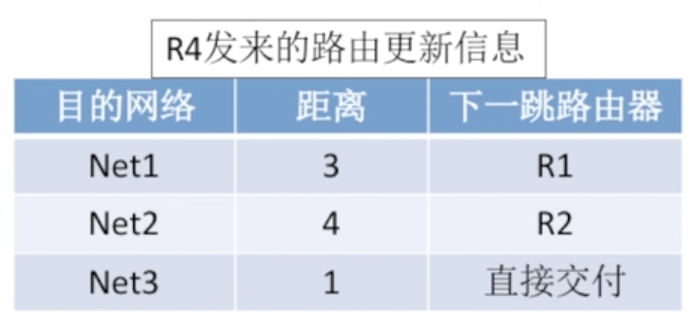
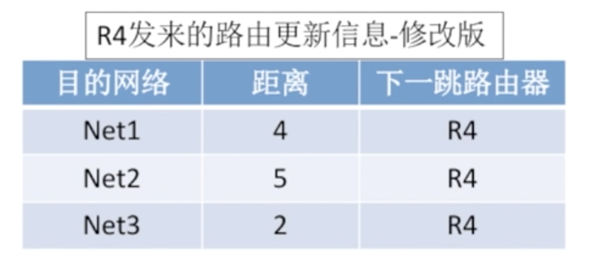
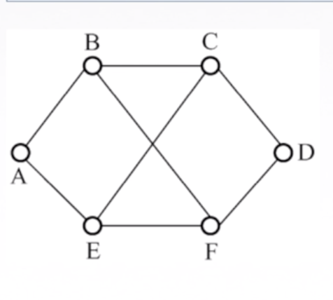

## 概述

## 内部网络协议 RIP 及距离向量算法

> 每**30秒**和**相邻路由器**交换**全部路由信息**

### 介绍

在比较小的网络中使用,**RIP** 是一种**分布式的基于距离向量的路由选择协议**，是因特网的协议标准，最大优点是简单。

RIP 协议要求网络中每一个**路由器都维护从它自己到其他每一个目的网络的唯一最佳距离记录**（即一组距离）。

比如:

> 距离：通常为“跳数”，即从源端口到目的端口所经过的路由器个数，经过一个路由器跳数+1。特别的，**从一路由器到直接连接的网络距离为 1**。RIP 允许一条路由最多只能包含 15 个路由器，因此距离为 16 表示网络不可达。

**RIP 协议只适用于小互联网**

### RIP 协议和谁交换？交换什么？多久交换一次？

1.仅和相邻路由器交换信息。

2.路由器交换的信息是自己的路由表。

> “我到 Net1 网络的（最短）距离是 5 跳，下一跳应该走 R1 路由器。

3. 每 30 秒交换一次路由信息，然后路由器根据新信息更新路由表。若超过 180 s 没收到邻居路由器的通告，则判定邻居没了，并更新自己路由表。

路由器刚开始工作时，只知道直接连接的网络的距离（距离为 1），接着每一个路由器也只和数目非常有限的相邻路由器交换并更新路由信息。

经过若干次更新后，所有路由器最终都会知道到达本自治系统任何一个网络的最短距离和下一跳路由器的地址，即“收敛”。

### 距离向量算法

1. 修改相邻路由器发来的 RIP 报文中所有表项

   对地址为 X 的相邻路由器发来的 RIP 报文，修改此报文中的所有项目.把“下一跳”字段中的地址改为 X，并把所有的“距离”字段+1。

2. 对修改后的 RIP 报文中的每一个项目，进行以下步骤:

    (1) R1 路由表中若没有 Net3, 则把该项目填入 R1 路由表.

    (2) R1 路由表中若有 Net3, 则査看下一跳路由器地址

   ​	若下一跳是 X，则用收到的项目替换源路由表中的项目(这是最新的信息)

   ​	若下一跳不是 X，原来距离比从 X 走的距离远则更新，否则不作处理。

3. 若 180 s 还没收到相邻路由器 X 的更新路由表，则把 X 记为不可达的路由器，即把距离设置为 16

4. 30s后继续循环

### 练习

已知路由器 R6 的路由表，现收到相邻路由器 R4 发来的路由更新信息，试更新路由器 R6 的路由表

解:

更新所有项

R4 发来的路由更新信息-修改版

按规则逐项更新

考虑如图所示的子网，该子网使用了距离-向量算法，下面的向量刚刚到达路由器 C：

来自 B 的向量为（5,0, 8,12,6,2）；

来自 D 的向量为（16,12,6,0,9,10）；

来自 E 的向量为（7,6,3,9,0,4) 

经过测量，C 到 B、D 和 E 的延退分別为 6,3 和 5,

那么 C 到达所有结点的最短路径是（) 

A. (5,6,0,9,6,2) B. (11,6,0,3,5,8) C. (5。1,0,12,8,9) D. (11,8,0,7,4,9)

C 到 B: (11,16,14,18,12,8)

C 到 D: (19,15,9,3,12,13) 

C 到 E: (11,8,14,5,9)

**B**

### RIP 协议的报文格式

RIP属于应用层协议,使用的是UDP.

等待补充

### RIP特点

#### 坏消息传的慢,好消息传的快

当网络出现故障时，要经过比较长的时间（例如数分钟）才能将此信息传送到所有的路由器，“慢收敛”

### 总结

## 内部网络协议 OSPF

### 介绍

Open Shortest Path First

**开放最短路径优先 OSPF 协议**：“开放”标明 OSPF 协议不是受某一家厂商控制，而是**公开发表**的.

“最短路径优先”是因为使用了 **Dijkstra** 提出的**最短路径算法 SPF**。

OSPF 最主要的特征就是使用**分布式的链路状态协议**。

### 特点

- 和谁交换 

  **使用洪泛法向自治系统内所有路由器发送信息**，即路由器通过输出端口向所有相邻的路由器发送信思，而每一个相邻路由器又再次将此信息发往其所有的相邻路由器。

  **等同广播,最终整个区域内所有路由器都得到了这个信息的一个副本**

- 交换什么

  发送的信息就是与本路由器相邻的所有路由器的链路状态（本路由器和哪些路由器相邻，以及该链路的度量/代价ーー费用、距离、时延、带宽等）。

- 多久交换

  只有当链路状态发生变化时，路由器才向所有路由器洪泛发送此信息。

最后，**所有路由器都能建立一个链路状态数据库，即全网拓扑图**。

### 链路状态路由算法

1. 每个路由器发现它的邻居结点,发送HELLO 问候分组，并了解邻居节点的网络地址。

2. 设置到它的每个邻居的成本度量 metric

3. 构造`DD 数据库描述分组`，向邻站给出自己的链路状态数据库中的所有链路状态项目的摘要信息。

4. 如果 DD 分组中的摘要自己都有，则邻站不做处理：如果有没有的或者是更新的，则发送`LSR 链路状态请求分组`请求自己没有的和比自己更新的信息。

5. 收到邻站的 LSR 分组后，发送`LSU 链路状态更新分组`进行更新 

6. 更新完毕后，邻站返回一个`LSAck 链路状态确认分组`进行确认。

只要一个路由器的链路状态发生变化：

5. 泛洪发送`LSU 链路状态更新分组`进行更新。

7. 更新完毕后，其他站返回一个`LSAck 链路状态确认分组`进行确认。

8. 使用 Dijkstra 根据自己的链路状态数据库构造到其他节点间的最短路径。

### OSPF的区域

为了使 OSPF能够用于规模很大的网络，OSPF 将一个自治系统再划分为若干个更小的范围，叫做区域。

每一个区域都有一个 32 位的区域标识符(用点分十进制表示),区域也不能太大，在一个区域内的路由器最好不超过 200 个。

主干区域:0.0.0.0。联通其他区域

- 主干路由器

​      主干区域中的路由器都叫做主干路由器

- 边界路由器

​      R3和R7既是主干路由器,也是区域边界路由器.

- 自治系统外界路由器

  连接其他自治系统

-   区域内部路由器

  区域内的路由器叫做区域内部路由器.

### OSPF分组

**OSPF 直接用 IP 数据报传送,可以看成网络层的协议。RIP协议使用UDP,某种程度上可以说是用户层的协议.**

### OSPF其他特点

1. 每隔 **30 min**，要刷新一次数据库中的链路状态。

2. 由于一个路由器的链路状态只涉及到与相邻路由器的连通状态，因而与整个互联网的规模并无直接关系。**因此当互联网规模很大时，OSPF 协议要比距离向量协议 RIP 好得多。**

3. **OSPF 不存在坏消息传的慢的问题，它的收敛速度很快**。

   根据信息更新全局拓扑

## 外部网络协议BGP

v4 

### 特点

- 和谁交换？

​     与其他 AS 的邻站 BGP 发言人交换信息。

- 交换什么？

  交换的网络可达性的信息，即要到达某个网络所要经过的一系列 AS。

- 多久交换？

  发生变化时更新有变化的部分

### BGP 协议交换信息的过程

**BGP 所交换的网络可达性的信息就是要到达某个网络所要经过的一系列 AS**。当 BGP 发言人互相交换了网络可达性的信息后，各 BGP 发言人就根据所采用的策略从收到的路由信息中找出到达各 AS 的较好路由。

BGP 发言人交换路径向量

自治系统 AS2 的 BGP 发言人通知主干网 AS1 的 BGP 发言人：“要到达网络 N1、N2、N3 和 N4 可经过 AS2。”

BGP 发言人交换路径向量

主干网还可发出通知：“要到达网络 N5、N6 和 N7 可沿路径（AS1, AS3)。

### BGP的报文格式

一个 BGP 发言人与其他自治系统中的 BGP 发言人要交换路由信息，就要**先建立 TCP 连接，即通过 TCP 传送**，然后在此连接上交换 BGP 报文以建立 **BGP 会话（session）**，利用 BGP 会话交换路由信息。

**BGP 是应用层协议，借助 TCP 传送。**

### BGP协议特点

BGP 支持 **CIDR**，因此 BGP 的路由表也就应当包括**目的网络前缀、下一跳路由器，以及到达该目的网络所要经过的各个自治系统序列**。

在 BGP 刚刚运行时，BGP 的邻站是交换整个的 BGP 路由表。但**以后只需要在发生变化时更新有变化的部分**。这样做对节省网络带宽和减少路由器的处理开销都有好处。

### BGP-4的四种报文

1.OPEN（打开）报文：用来与相邻的另一个 BGP 发言人建立关系，并认证发送方。

2.UPDATE（更新）报文：通告新路径或撤销原路径。

3.KEEPALIVE（保活）报文：在无 UPDATE时，周期性证实邻站的连通性；也作为 OPEN 的确认。

4. NOTIFICATION（通知）报文：报告先前报文的差错：也被用于关闭连接。

## 三种协议对比

`RIP` 是一种**分布式的基于距离向量**的**内部网关路由选择协议**，通过**广播 UDP 报文**来交换路由信息。

`OSPF `是一个**内部网关协议**，要交换的信息量较大，应使报文的长度尽量短，所以不使用传输层协议（如 UDP 或 TCP），而是直接采用**IP**。

`BGP` 是一个**外部网关协议**，在不同的自治系统之间交换路由信息，**由于网络环境复杂，需要保证可靠传输，所以用 TCP**

