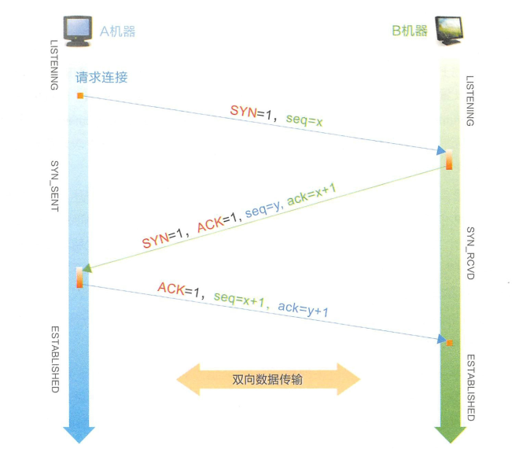

# TCP

## 介绍

程序在发送消息时，应用层接既定的协议打包数据， 随后由**传输层加上双方的端口号，由网络层加上双方的IP 地址，由链路层加上双方的MAC 地址， 并将数据拆分成数据帧**， 经过多个路由器和网关后， 到达目标机器。简而言之， 就是按“ 端口→ IP 地址→ MAC 地址” 这样的路径进行数据的封装和发送， 解包的时候反过来操作即可。

**特点**

- TCP是面向连接（虚连接）的传输层协议。打call
- 每一条TCP连接只能有两个端点(ip + 端口号)，每一条TCP连接只能是点对点的。
- TCP提供可靠交付的服务，无差错、不丢失、不重复、按序到达。**可靠有序，不丢不重**
- TCP提供全双工通信。
        -  发送缓存：准备发送的数据  +  己发送但尚未收到确认的数据
        -  接收缓存：按序到达但尚未被接受应用程序读取的数据  +  不按序到达的数据
 - TCP面向字节流TCP把应用程序交下来的数据看成仅仅是一连串的无结构的字节流。

## TCP与UDP

- 连接管理

- 可靠传输
  - 顺序传输
  - 超时重传
  - 差错处理 
- 流量控制

- 拥塞控制

## 报头

- 源端口 + 目的端口

  协议第一行的两个端口号各占两个字节（16bit 0-65535）,分别表示了源机器和目标机器的端口号。
  这两个端口号与 IP 报头中的源地址和目标IP地址所组成的四元组可唯一标识一条TCP 连接。

- 序号seq
  
  所发送数据包中数据部分第一个字节的序号
  
- 确认号ack
  
  期望收到来自对方的下一个数据包中数据部分第一个字节的序号
  
- 头部数据偏移 + 保留  + 6个flag  + 窗口
  
  - 头部数据偏移4bit，单位4B，标志数据部分开头偏移量
  
    由于 TCP 报头中存在一些扩展字段,所以需要通过长度为 4 个 bit 的头部长度字段表示 TCP 报头的大小,这样接收方才能准确地计算出包中数据部分的开始位置。
  
  - 保留位6bit
  
  - 6个flag
  
    TCP 的 FLAG 位由 6 个 bit 组成,分别代表 ACK 、 SYN 、 F町、 URG 、 PSH 、RST ,都以置 1 表示有效.
  
    SYN ( Synchronize  Sequence Numbers )用作建立连接时的同步信号 
  
    ACK ( Acknowledgement )用于对收到的数据进行确认,所确认的数据由确认序列号表示。连接建立后所有报文ACK都是1.
  
    FIN ( Finish )表示后面没有数据需要发送,通常意昧着所建立的连接需要关闭了。
  
    URG 紧急标志位：发送方直接处理，不走发送缓存队列，配合紧急指针使用
  
    PSH：PSH=1时，接收方尽快交付接收应用进程，不再等到缓存填满再向上交付。
  
    RST：复位，TCP连接严重差错，释放后重新连接。
  
  -  窗口大小
  
    发送本报文段一方的接受窗口，即现在允许对方发送的数据量

  

- 校验和 + 紧急指针
  
  检验和：检验首部+数据，检验时要加上12B伪首部，第四个字段为6（TCP协议），7（UDP协议）。
  
  紧急指针：URG=1时才有意义，指出本报文段中紧急数据的字节数（从数据开头到它指示的结尾是紧急数据）。
  
- 选项+填充

## 连接管理

### 三次握手

注意两端状态的变化

### 为什么不是两次握手？  

#### 信息对等

  A ----SYN=1,seq=x------------------------------> B // 成功 B确认:B机器收，A机器发    
  A <---SYN=1,seq=y,ACK=1,ack=x+1---------- B // 成功 A确认:A机器发，A机器收，B机器收，B机器发   
  A ----seq=x+1,ACK=1,ack=y+1---------------> B // 成功 B确认:A机器收，B机器发

双方都确认了自己的收发能力和对方的收发能力。

#### 防止脏连接

  

两次就建立连接是危险的行为，以B机器为例子，只要收到A机器的请求就建立连接。

TTL 网络报文的生存时间往往都会超过 TCP 请求超时时间 , 如果两次握手就可以创建连接 , 传输数据并释放连
接后 , 第一个超时的连接请求才到达 B 机器的话 , B 机器会以为是 A 创建新连接的请求 , 然 后确 认 同意创建连接。因为 A 机器的状态不是 SYN_SENT , 所以直接丢弃了 B 的确认数据 , 以致最后只是 B 机器单方面创建连接完毕 .

而如果是三次握手， 则B 机器收到连接请求后，同样会向A 机器确认同意创建连接，但因为A 机器不是SYN SENT 状态，所以会直接丢弃， B 机器由于长时间没有收到确认信息， 最终超时导致连接创建失败，因而不会出现脏连接。

### 四次挥手

男生：我们分手吧。
女生：好的,我的东西收拾完,发信息给你。( 此时男生不能再拥抱女生了。)
( 1 个小时后)
女生：我收拾好了,分手吧。
男生：好的(此时 , 女生也不能再拥抱男生了)
(此时 , 双方约定经过 2 个月的过渡期,双方才可以分别找新的对象)

### 为什么需要time_wait?

**对B机器负责**

如果B机器没有收到最后一次ACK，B机器会重发FIN+ACK。这样可以确保B机器进入closed状态   

**加一点空档期**

并且防止己失效连接的请求数据包与正常连接的请求数据包混淆而发生异常。

## 可靠传输

这依赖四种机制的保证

### 校验

伪首部

### 序号

给传输的字节编号

### 确认重传不分家

确认是ack确认

但是一旦出现报文丢失

重传包括以下两种：

**超时重传**

确认重传不分家，TCP的发送方在**规定的时间**内没有收到确认就要重传己发送的报文段。超时重传

规定的时间实际就是重传时间
TCP采用自适应算法，动态改变重传时间RTTs（加权平均往返时间）。

**冗余ACK，快速重传**机制

每当比期望序号大的失序报文段到达时，发送一个**冗余ACK**，指明下一个期待字节的序号。
发送方己发送1，2，3，4，5报文段
接收方收到1，返回给1的确认（确认号为2的第一个字节）
接收方收到3，仍返回给1的确认（确认号为2的第一个字节）
接收方收到4，仍返回给1的确认（确认号为2的第一个字节）
接收方收到5，仍返回给1的确认（确认号为2的第一个字节）
发送方收到**3个对于报文段1的冗余ACK**，认为2报文段丢失，重传2号报文段 （快速重传技术）

## 流量控制

是对发送方的一种控制，让发送方发慢点，接收方来得及接受。

TCP使用滑动窗口机制实现流量控制

### 滑动窗口

在通信过程中，接收方根据自己接收缓存的大小，动态地调整发送方的发送窗口大小，即接收窗口rwnd（接收方设置确认报文段的窗口字段来将rwnd通知给发送方）,发送方的发送窗口取接收窗口rwnd和拥寒窗口cwnd的最小值

**实例**

A B连接建立，B告诉Arwnd是400字节，设每个报文段100B，报文序列号初始值为1

**发送一个rwnd=0后，下一条滑动窗口通知丢失如何解决？**

TCP为每一个连接设有一个持续计时器，只要TCP连接的一方收到对方的零窗口通知，就启动持续计时器。

若持续计时器设置的时间到期，就发送一个零窗口探测报文段。
接收方收到探测报文段时给出现在的窗口值。若窗口仍然是0，那么发送方就重置持续计时器。

## 拥塞控制

出现拥塞的条件：对资源需求的总和>可用资源

这里的资源比如网络带宽，以及中转节点缓存（路由器）等

一旦网络中有很多资源同时呈现供应不足，网络的吞吐量将随输入负荷增大而下降

**拥塞控制就是防止过多的数据注入到网络中**，这是一个全局性的控制

假定：
1．数据单方向传送，而另一个方向只传送确认
2．接收方总是有足够大的缓存空间，因而发送窗口大小取决于拥塞程度

发送窗口=Min{接收窗口rwnd，拥寒窗口cwnd}

接收窗口：**接收方**根据接受缓存设置的值，并告知给发送方，**反映接收方容量**。
拥塞窗口：**发送方**根据自己估算的网络拥塞程度而设置的窗口值，**反映网络当前容量**。

### 慢开始 + 拥塞避免

 

纵坐标的单位是报文段

横坐标的单位是轮次：

一个传输轮次是发送了一批报文段并收到它们的确认的时间。一个往返RTT，或者说开始发送一批拥塞
窗口内的报文段到开始发送下一批拥塞窗口内的报文段的时间。

### 快重传 + 快恢复

 

利用冗余ACK

## 总结

