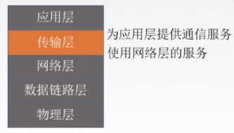
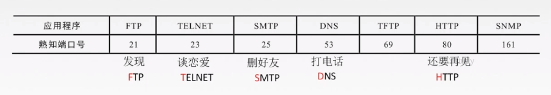

# 传输层

## 功能

提供进程和进程之间的逻辑 通信

## 两种协议

### TCP 

面向连接的传输控制协议TCP传送数据之前必须建立连接，数据传送结束后要释放连接。不提
供广播或多播服务。由于TCP要提供可靠的面向连接的传输服务，因此不可避免壤加了许多开销；
确认、流量控制、计时器及连接管理等。

场景：

可靠，面向连接，时延大，适用大文件。

### UDP

无连接的用户数据报协议UDP传送数据之前不需要建立连接，收到UDP报文后也不需要给出任
何确认。

场景：

不可靠，无连接，时延小，适用于小文件。

## 传输层寻址与端口号

复用：应用层所有的应用进程都可以通过传输层再传输到网络层。
分用：传输层从网络层收到数据后交付指明的应用进程。

逻辑端口/软件端口是传输层的SAP，标识主机中的应用进程。

端口号只有本地意义，在因特网中不同计算机的相同端口是没有联系的。
端口号长度为16bit，能表示65536个不同的端口号。

按范围划分：
- 熟知端口号：给TCP/IP最重要的一些应用程序，让所有用户都知道。
  0-1023
  服务端使用
  
- 登记端口号：为没有熟知端口号的应用程序使用的。
    1024～49151
- 客户端使用：仅在客户进程运行时才动态选择。
  49152-65535

## 套接字

在网络中采用发送方和接收方的套接字组合来识别端点，套接字唯一标识了网络中的一个主机和它上面的一个进程。
套接字socket=（主机ip地址 + 端口号）